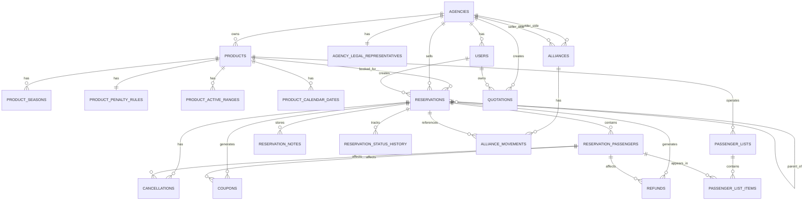

# LDS - Backlog Priorizado, Criterios de Aceptacion, Tareas Tecnicas y Roadmap

## Nota de lectura operativa

- Fecha de alineacion documental: `2026-04-14`
- este archivo sigue siendo la fuente funcional oficial del proyecto
- las secciones `2` a `10` conservan backlog funcional amplio y siguen sirviendo como referencia de alcance
- las secciones `12` a `26` conservan desgloses historicos previos y no deben leerse como estado operativo actual
- para el estado real mas reciente del proyecto complementar con:
- `docs/analysis/LDS_diagnostico_estado_actual.md`
- `docs/analysis/LDS_matriz_ejecutiva_modulos.md`
- `docs/analysis/LDS_contraste_docs_vs_codigo_2026-04-14.md`
- cuando exista conflicto entre desgloses historicos y el modelo vigente, prevalece el modelo actual de:
- Supabase como fuente principal
- cupos por fecha
- `capacity_override` por fecha
- `capacity_requests` para ampliacion
- reservas base ya operativas con detalle navegable

## 1. Escala de prioridad

- `P0`: indispensable para el MVP operativo
- `P1`: importante para salida comercial controlada
- `P2`: mejora funcional necesaria para escalar
- `P3`: mejora posterior o de optimizacion

## 2. Historias priorizadas con criterios de aceptacion

### Modulo 1. Acceso, usuarios y agencias

#### US-001 - Crear agencias
- Prioridad: `P0`
- Historia: Como `super usuario`, quiero crear agencias vendedoras y proveedoras para habilitar nuevas empresas dentro de LDS.
- Criterios de aceptacion:
- se puede crear una agencia con nombre, NIT, tipo de persona, direccion, telefono, email, horario, ciudad y pais
- se puede registrar el representante legal con nombre, documento, telefono, email y cargo
- la agencia queda clasificada como `vendedora` o `proveedora`
- la agencia queda disponible para asociar usuarios

#### US-002 - Crear usuarios por agencia
- Prioridad: `P0`
- Historia: Como `admin de agencia` o `super usuario`, quiero crear usuarios asociados a una agencia para habilitar operacion comercial.
- Criterios de aceptacion:
- el formulario solicita nombre, apellido, celular, email y foto
- la foto se puede dejar vacia y LDS usa una imagen por defecto
- en entorno de desarrollo el usuario puede quedar operativo sin confirmacion por email
- todo usuario queda asociado a una agencia especifica
- se permite definir si el usuario es `admin` o `agente de viajes`

#### US-003 - Activacion por email
- Prioridad: `P0`
- Historia: Como `sistema`, quiero activar usuarios solo despues de confirmar email para asegurar que el correo existe.
- Criterios de aceptacion:
- en produccion se envia email de activacion
- en desarrollo LDS puede confirmar el usuario de forma administrativa para no bloquear pruebas internas
- el comportamiento final debe quedar gobernado por configuracion del entorno

#### US-004 - Editar perfil propio
- Prioridad: `P1`
- Historia: Como `usuario`, quiero editar mi propio perfil para mantener actualizados mis datos.
- Criterios de aceptacion:
- el usuario puede cambiar al menos su foto de perfil
- la foto se selecciona desde el repositorio local de desarrollo y en Supabase se guarda solo el filename
- los cambios quedan guardados en su perfil
- si cambia el email, el sistema puede requerir nueva validacion

#### US-005 - Ver detalle de agencia y usuarios asociados
- Prioridad: `P1`
- Historia: Como `admin de agencia` o `super usuario`, quiero abrir el detalle de una agencia y ver la lista de usuarios asociados, con su rol y estado, para poder administrarlos.
- Criterios de aceptacion:
- la vista de agencia muestra los datos generales y del representante legal
- la vista muestra una tabla de usuarios asociados
- cada usuario muestra nombre, tipo de usuario y estado
- la tabla permite buscar por nombre y filtrar por tipo y estado
- el `super usuario` puede ver todas las agencias
- el `agency_admin` solo puede ver y administrar su propia agencia

### Modulo 2. Productos y configuracion comercial

#### US-006 - Crear producto turistico
- Prioridad: `P0`
- Historia: Como `admin de agencia proveedora`, quiero crear un producto turistico con su informacion comercial y operativa para ponerlo a la venta.
- Criterios de aceptacion:
- el producto registra nombre, ciudad, punto de encuentro, horario de salida, horario de llegada y descripcion breve
- el producto permite configurar temporadas altas
- el producto permite configurar multas de cancelamiento, no show y reembolso
- el producto queda en estado pendiente de habilitacion al finalizar el formulario

#### US-007 - Habilitar producto con fechas activas
- Prioridad: `P0`
- Historia: Como `admin de agencia proveedora`, quiero habilitar un producto definiendo fechas activas para permitir su venta y operacion.
- Criterios de aceptacion:
- al hacer clic en `habilitar`, LDS redirige al calendario del producto
- si el producto es nuevo o inactivo, se abre automaticamente un modal obligatorio
- el modal no se puede cerrar con `Escape` ni con clic fuera
- el usuario debe definir fecha inicial, fecha final y cupo base por fecha antes de usar el calendario
- la fecha inicial no permite valores anteriores a hoy
- la fecha inicial solo permite seleccionar hasta el 31 de diciembre del mismo ano
- la fecha final solo permite seleccionar desde la fecha inicial hasta el 31 de enero del ano siguiente

### Modulo 3. Calendario de productos

#### US-008 - Ver calendario de ocupacion
- Prioridad: `P0`
- Historia: Como `admin de agencia proveedora`, quiero ver el calendario del producto para identificar rapidamente fechas libres, ocupadas y no operables.
- Criterios de aceptacion:
- la vista muestra nombre del producto, ciudad, punto de encuentro, hora de salida, hora de llegada y descripcion breve
- cada celda muestra el numero del dia
- las celdas sin reservas aparecen en blanco
- las celdas con reservas usan verde con intensidad segun porcentaje de ocupacion
- las celdas no operables aparecen en rojo
- el calendario permite navegar por fecha, mes y ano

#### US-009 - Marcar temporada alta en calendario
- Prioridad: `P1`
- Historia: Como `admin de agencia proveedora`, quiero ver en el calendario las fechas de temporada alta para distinguirlas de un vistazo.
- Criterios de aceptacion:
- las fechas definidas como temporada alta se muestran con una bolita negra o gris oscuro alrededor del numero del dia
- el numero del dia se muestra en blanco para dar contraste
- la marca de temporada alta no reemplaza el color de ocupacion de la celda

#### US-010 - Inactivar y reactivar fechas
- Prioridad: `P0`
- Historia: Como `admin de agencia proveedora` o `super usuario`, quiero inactivar o reactivar fechas operativas del producto respetando reglas de proteccion al cliente.
- Criterios de aceptacion:
- una fecha solo se puede inactivar si no tiene reservas activas
- si la fecha tiene reservas activas, nadie puede inactivarla
- si alguien intenta inactivarla con reservas activas, LDS bloquea la accion y envia alerta por email al super usuario
- una fecha inactiva puede ser reactivada por el admin proveedor o el super usuario
- si el producto completo queda inhabilitado por caso critico, su reactivacion posterior solo la puede ejecutar el `super_user`

### Modulo 4. Reservas

#### US-011 - Crear reserva
- Prioridad: `P0`
- Historia: Como `usuario operativo de agencia vendedora o proveedora`, `admin de agencia` o `super usuario`, quiero crear una reserva para vender un producto turistico a un cliente.
- Criterios de aceptacion:
- todos los roles operativos autorizados pueden crear reservas
- la reserva queda asociada al usuario creador y a la agencia correspondiente
- la reserva puede nacer en estado `reservada`
- una reserva `reservada` debe guardar `expires_at`
- `expires_at` siempre corresponde exactamente a `24 horas antes de la fecha y hora de la actividad`
- si el usuario intenta crear una reserva dentro de las ultimas `24 horas` antes de la actividad, LDS no debe permitir `reservar`; solo debe permitir `emitir`
- la reserva conserva localizador unico
- el localizador usa exactamente `6` caracteres alfanumericos sin ambiguedad
- el alfabeto permitido es `ABCDEFGHJKMNPQRSTUVWXYZ23456789`
- cada una de las `6` posiciones puede usar cualquiera de los `31` caracteres validos
- el universo objetivo del localizador es `31^6 = 887,503,681` combinaciones
- el localizador se genera en mayusculas
- el localizador es inmutable y no se recicla nunca, incluso si la reserva se cancela
- el localizador debe ser `unique` en base de datos
- si ocurre una colision, LDS debe regenerarlo automaticamente
- si no hay cupo suficiente, la reserva no se crea y LDS genera una solicitud previa de ampliacion

#### Flujo detallado de creacion de reserva

- la reserva comienza en el `booking card` dentro del detalle del producto
- antes de crear la reserva, el usuario debe completar en el `booking card`:
  - cantidad de `adultos`
  - cantidad de `ninos`
  - cantidad de `bebes`
  - fecha de viaje
  - cupon de descuento si aplica
- el `booking card` debe mostrar:
  - valores individuales por tipo de pasajero
  - subtotal o valores parciales
  - valor total final de la reserva
- la validacion del cupon ocurre en el `booking card` antes de dar clic en `Reservar`
- cuando el usuario da clic en `Reservar`, LDS valida:
  - disponibilidad de cupo para la fecha
  - vigencia del cupon si existe
  - consistencia de cantidades y total calculado
- si no hay cupo suficiente:
  - no se crea la reserva
  - se crea una solicitud previa de ampliacion
- si la validacion pasa, LDS abre un modal para el flujo de inclusion de pasajeros
- el orden obligatorio de captura de pasajeros es:
  1. adultos
  2. ninos
  3. bebes
- la interfaz de pasajeros debe guiar el avance por tipo y por indice, por ejemplo:
  - `Ingresar informacion pasajero adulto 1 de 5`
  - luego `adulto 2 de 5`
  - al terminar adultos, pasar a ninos
  - al terminar ninos, pasar a bebes
- por cada pasajero se capturan al menos:
  - nombre
  - fecha de nacimiento
  - documento
  - nacionalidad
  - sexo
- al completar todos los pasajeros, LDS no crea todavia la reserva definitiva
- despues del modal de pasajeros, LDS abre una pantalla de `Resumen de la reserva`
- esa pantalla debe mostrar al menos:
  - estado inicial de la reserva
  - resumen del producto comprado
  - fecha de la reserva
  - lista de pasajeros cargados
  - posibilidad de editar los datos de cada pasajero
  - valores unitarios de adulto, nino y bebe
  - descuentos aplicados
  - valor total
- el localizador definitivo no debe generarse todavia en esta pantalla
- el localizador se asigna solo cuando la reserva se crea realmente al confirmar
- si la fecha de la actividad ya esta dentro de las ultimas `24 horas`, al abrir esta pantalla LDS debe mostrar de inmediato un modal informando que ya no se puede reservar y que solo se puede emitir
- toda la informacion financiera en esta pantalla es solo de consulta
- en esta pantalla no se permite editar:
  - valores unitarios
  - descuentos
  - valor total
- la pantalla debe mostrar un bloque de advertencia o confirmacion del emisor indicando que:
  - reviso cuidadosamente la informacion de los pasajeros
  - cualquier error en los datos digitados es responsabilidad del emisor
  - despues de emitida la reserva pueden aplicar cargos adicionales, multas o restricciones segun proveedor
- la pantalla final debe incluir un boton de `Confirmar`
- al dar clic en `Confirmar`, LDS crea la reserva real
- en ese momento LDS genera y asigna el localizador definitivo
- la reserva creada debe guardar:
  - localizador unico
  - agencia creadora
  - usuario creador
  - fecha de viaje
  - cantidades por tipo de pasajero
  - cupon aplicado si existe
  - valores individuales y total
  - estado inicial `reserved`
  - `expires_at`
- si la reserva no es emitida antes de `expires_at`, LDS debe cancelarla automaticamente por vencimiento

#### US-012 - Ver detalle completo de reserva
- Prioridad: `P0`
- Historia: Como `usuario autorizado sobre la reserva`, `admin de su agencia` o `super usuario`, quiero abrir una reserva y ver toda su informacion comercial, operativa, financiera e historica para darle seguimiento.
- Criterios de aceptacion:
- la reserva muestra informacion general, pasajeros, estados individuales y metodo de pago
- la reserva muestra valores pagados, descuentos y cupones aplicados
- la reserva muestra historial de movimientos desde la creacion hasta el check in
- la reserva muestra notas especiales y novedades
- aunque la reserva este inactiva por cancelacion, reembolso o vencimiento, sigue abriendo en modo consulta

#### US-013 - Buscar y filtrar reservas
- Prioridad: `P0`
- Historia: Como `usuario operativo con acceso al panel de reservas`, `admin de agencia` o `super usuario`, quiero buscar y filtrar reservas rapidamente para encontrar operaciones especificas.
- Criterios de aceptacion:
- se puede buscar por localizador
- se puede filtrar por fecha de emision, fecha de creacion y fecha de embarque
- se puede usar periodos rapidos: hoy, ultimos 7 dias, ultimos 15 dias, ultimos 30 dias
- se puede filtrar por fecha inicio y fecha fin
- despues de obtener resultados, se puede refinar por nombre de turista, documento y estado
- los resultados se pueden agrupar por producto con conteos

#### US-014 - Imprimir y enviar reserva
- Prioridad: `P1`
- Historia: Como `usuario autorizado sobre la reserva`, `admin de su agencia` o `super usuario`, quiero imprimir o enviar por email una reserva para compartirla con el cliente.
- Criterios de aceptacion:
- la reserva ofrece accion `Imprimir`
- la reserva ofrece accion `Enviar por email`
- la accion usa los datos completos de la reserva

#### US-015 - Dividir reserva
- Prioridad: `P1`
- Historia: Como `usuario autorizado sobre la reserva`, `admin de su agencia` o `super usuario`, quiero dividir una reserva activa para separar uno o varios pasajeros en una nueva reserva manteniendo las mismas condiciones.
- Criterios de aceptacion:
- la accion solo aplica a reservas `reservadas` o `emitidas`
- la reserva nueva conserva producto, destino, fechas, itinerario y precios
- la reserva original conserva los pasajeros restantes
- la division no genera cancelacion, cupon ni reembolso

### Modulo 5. Estados y notificaciones de reserva

#### US-016 - Gestionar estados de reserva
- Prioridad: `P0`
- Historia: Como `sistema`, quiero gestionar el ciclo de vida de la reserva para aplicar reglas operativas y comerciales.
- Criterios de aceptacion:
- la reserva soporta al menos estados `reservada`, `emitida`, `cancelada por usuario`, `cancelada por vencimiento` y `en reembolso`
- los resultados de pago no son estados de reserva; son eventos o intentos de pago separados
- una reserva `reservada` puede vencer si no se emite a tiempo
- mientras no llegue `expires_at`, una reserva sigue siendo `reservada` aunque existan multiples intentos de pago fallidos
- una reserva `emitida` no vence
- solo una reserva `emitida` puede pasar a `en reembolso`

#### US-017 - Notificar cambio de estado
- Prioridad: `P0`
- Historia: Como `sistema`, quiero generar notificaciones cada vez que cambia el estado de una reserva para mantener trazabilidad.
- Criterios de aceptacion:
- todo cambio de estado genera una notificacion
- aplica a reservada, emitida, cancelada por usuario, cancelada por vencimiento y en reembolso
- la notificacion queda registrada para consulta

### Modulo 6. Cancelaciones, cupones y reembolsos

#### US-018 - Cancelar reserva completa o por pasajero
- Prioridad: `P0`
- Historia: Como `creador de reserva` o `admin de su agencia`, quiero cancelar una reserva completa o solo un pasajero para resolver solicitudes del cliente.
- Criterios de aceptacion:
- se permite cancelacion completa
- se permite cancelacion individual por pasajero
- la cancelacion parcial crea una reserva hija cancelada para el pasajero afectado
- toda cancelacion crea registro historico de cancelacion

#### US-019 - Resolver cancelacion con cupon o reembolso
- Prioridad: `P0`
- Historia: Como `sistema`, quiero preguntar si una cancelacion se resuelve por cupon o reembolso para aplicar la salida correcta.
- Criterios de aceptacion:
- al cancelar, LDS pregunta si se desea `reembolso` o `credito en cupon`
- si la reserva estaba `reservada`, no se genera cupon automaticamente por simple cancelacion
- si la reserva estaba `emitida`, la resolucion puede terminar en cupon o reembolso segun eleccion
- el sistema calcula el valor neto despues de multas

#### US-020 - Aplicar reglas de multas
- Prioridad: `P0`
- Historia: Como `sistema`, quiero aplicar correctamente multas de cancelacion, no show y reembolso para calcular el saldo del cliente.
- Criterios de aceptacion:
- la multa de cancelacion y la multa de no show son excluyentes
- la multa de reembolso se aplica adicionalmente si el cliente solicita reembolso
- los valores son definidos por el dueno del producto
- el sistema soporta productos con reembolso alto o sin reembolso

#### US-021 - Cancelacion sin multas por responsabilidad de la agencia
- Prioridad: `P0`
- Historia: Como `sistema`, quiero devolver el 100 por ciento al cliente cuando la cancelacion o alteracion es responsabilidad del dueno del producto.
- Criterios de aceptacion:
- si la agencia dueña del producto cancela por clima, operacion o cambios de fecha u horario, multa de cancelacion = 0
- si el cliente solicita reembolso en ese escenario, tasa de reembolso = 0
- el cliente puede recibir cupon del 100 por ciento o reembolso integral
- si el cliente acepta el cambio de fecha u horario, no se genera multa ni devolucion y la reserva continua operando
- LDS envia email automatico notificando la alteracion al cliente

#### US-022 - Ver y gestionar cupon
- Prioridad: `P1`
- Historia: Como `usuario autorizado sobre la reserva o el cupon`, `admin de su agencia` o `super usuario`, quiero abrir un cupon y ver toda su informacion y relacion con la reserva para gestionarlo correctamente.
- Criterios de aceptacion:
- el cupon muestra codigo, agencias, agente creador, motivo y fecha
- el cupon muestra bloque de informacion de reserva asociada
- el cupon muestra bloque economico con valor del producto, multa y saldo final
- el cupon permite PDF y envio por email
- el cupon ofrece accion para solicitar reembolso si el cliente no desea usarlo

#### US-023 - Ver y gestionar reembolso
- Prioridad: `P0`
- Historia: Como `usuario autorizado sobre el reembolso`, `admin de su agencia` o `super usuario`, quiero abrir un reembolso y ver su estructura completa para hacer seguimiento financiero entre agencias.
- Criterios de aceptacion:
- el reembolso muestra codigo, agencias involucradas, creador, fechas y estado
- el reembolso muestra la informacion de la reserva y del pasajero
- el reembolso muestra bloque economico con tarifa, multas aplicadas y saldo
- si el estado es `Por pagar`, la agencia dueña del producto puede subir comprobante de pago
- la agencia compradora puede solicitar pago por email automatico si sigue pendiente
- cuando el pago existe, la agencia compradora puede ver y descargar el comprobante

### Modulo 7. Lista de pasajeros y check in

#### US-024 - Ver listas de pasajeros
- Prioridad: `P0`
- Historia: Como `usuario de agencia proveedora` o `admin de agencia proveedora`, quiero ver listas de pasajeros por producto y fecha para operar el servicio del dia.
- Criterios de aceptacion:
- la entrada al modulo se hace desde `Lista de pasajeros`, no desde el panel de reservas
- la pantalla principal muestra nombre de producto, fecha, estado y boton `Ver lista`
- la lista puede estar `Inactiva`, `Activa` o `Check in`

#### US-025 - Operar check in por pasajero
- Prioridad: `P0`
- Historia: Como `operador proveedor`, quiero marcar check in o no show por pasajero para reflejar quien realmente viajo.
- Criterios de aceptacion:
- al abrir la lista se muestran localizador, agencia, tipo de pasajero, documento, pais, sexo, edad y celular
- si la lista esta `Activa`, cada pasajero muestra boton `Reserva`
- si la lista esta en estado `Check in`, cada pasajero muestra botones `Reserva` y `Check in`
- el check in se realiza por pasajero, no por reserva completa

#### US-026 - Gestionar no show y reservas hijas
- Prioridad: `P0`
- Historia: Como `sistema`, quiero manejar no show por pasajero creando reservas hijas y cupones para mantener trazabilidad completa.
- Criterios de aceptacion:
- al marcar no show, se crea una reserva hija individual cancelada
- se genera un cupon individual para ese pasajero
- la reserva original conserva a quienes si viajaron
- la reserva original guarda historico con turista, fecha de no show y reserva hija creada

#### US-027 - Ver novedades en lista inactiva
- Prioridad: `P1`
- Historia: Como `usuario proveedor`, quiero revisar listas inactivas con novedades finales para consultar el resultado del embarque.
- Criterios de aceptacion:
- pasajeros chequeados muestran fecha, hora exacta y agente que hizo check in
- pasajeros no show muestran fecha, agencia y cupon asociado
- pasajeros con cancelacion o reembolso muestran bloque de novedad debajo de su informacion
- si la novedad es cupon, existe boton `Ver cupon`
- si la novedad es reembolso, existe boton `Ver reembolso`

### Modulo 8. Reportes

#### US-028 - Reporte de ventas
- Prioridad: `P1`
- Historia: Como `usuario`, quiero generar reportes de ventas detallados y consolidados para analizar el desempeno comercial.
- Criterios de aceptacion:
- el reporte detallado muestra localizador, fecha de emision, valor, usuario vendedor y tipo de venta
- el reporte consolidado soporta agrupacion por valor, forma de pago y usuario
- el reporte permite filtros por usuario, fecha y forma de pago
- el reporte permite PDF y envio por email

#### US-029 - Reporte de ganancias
- Prioridad: `P1`
- Historia: Como `usuario`, quiero generar reportes de ganancias detallados y consolidados para medir utilidad por producto y vendedor.
- Criterios de aceptacion:
- el reporte detallado muestra localizador, fecha, ganancia, usuario y tipo de pago
- el consolidado soporta agrupacion por forma de pago y por usuario
- el reporte permite filtros por fecha
- el reporte permite PDF y envio por email

#### US-030 - Reporte de ventas facturado
- Prioridad: `P1`
- Historia: Como `usuario`, quiero generar reportes de ventas facturadas para controlar creditos operados entre agencias.
- Criterios de aceptacion:
- el detallado muestra localizador, fecha, valor, agencia que vendio y estado pagado/no pagado
- existe consolidado por agencia
- existe consolidado por estado general pagado/no pagado
- el reporte permite PDF y envio por email

#### US-031 - Reportes de novedades y reembolsos
- Prioridad: `P1`
- Historia: Como `usuario`, quiero generar reportes de novedades y gestion de reembolsos para controlar incidencias operativas.
- Criterios de aceptacion:
- existe reporte general de novedades por fechas con cancelados, no show y reembolsos
- existen reportes especificos consolidados y detallados por producto para cancelados, no show y reembolsos
- existen reportes de reembolsos `En reembolso`, `Pagados` y `Por pagar`
- todos permiten filtros por fecha, PDF y envio por email

### Modulo 9. Alianzas y ventas facturadas

#### US-032 - Crear alianza comercial
- Prioridad: `P1`
- Historia: Como `admin de agencia proveedora`, quiero crear una alianza con una agencia vendedora para otorgarle credito facturado.
- Criterios de aceptacion:
- la pantalla muestra ciudad y nombre de la agencia proveedora
- existe bloque `Buscar Agencia Aliada` con input y boton `Buscar`
- LDS devuelve nombre, NIT, tipo de persona, direccion, telefono, email, ciudad y pais de la agencia encontrada
- se puede ingresar el `Valor Facturado`
- se puede adjuntar imagen del contrato entre agencias

#### US-033 - Ver lista de alianzas
- Prioridad: `P1`
- Historia: Como `admin`, quiero ver las alianzas creadas para consultar su estado y abrir su detalle.
- Criterios de aceptacion:
- la lista muestra agencia proveedora, agencia vendedora, estado y boton `Ver`
- existen estados `Activo`, `Inactivo` y `Suspendido`
- la pantalla principal ofrece boton `Crear alianza`

#### US-034 - Ver movimientos de alianza
- Prioridad: `P1`
- Historia: Como `admin`, quiero abrir una alianza y ver sus movimientos para controlar el saldo del credito facturado.
- Criterios de aceptacion:
- la vista muestra ciudad, agencia aliada, valor facturado y saldo actual
- existe filtro por tiempo: hoy, ultimos 7 dias, esta semana y otros periodos
- los movimientos se muestran del mas reciente al mas antiguo
- la tabla muestra movimiento, fecha, descripcion, valor, saldo y boton `Ver`
- una `Venta` se ve en rojo y descuenta saldo
- un `Pago` se ve en negro y suma saldo
- si el movimiento es pago, `Ver` abre el recibo
- si el movimiento es venta, `Ver` abre la reserva

## 3. Tareas tecnicas por modulo

### 3.1. Acceso, usuarios y agencias
- modelar tablas o colecciones: `agencies`, `legal_representatives`, `users`
- definir roles y permisos base
- implementar flujo de activacion por email
- crear CRUD de usuarios con relacion obligatoria a agencia
- crear vista detalle de agencia con tabla de usuarios y filtros

### 3.2. Productos y calendario
- modelar `products`, `product_subcategories`, `product_subcategory_links`, `product_detail_content`, `product_gallery_images`, `product_seasons`, `product_penalties`, `product_calendar_dates`
- implementar wizard o flujo de creacion de producto
- implementar redireccion obligatoria al calendario al habilitar
- implementar modal bloqueante de fechas activas
- construir componente calendario con reglas de color por ocupacion, temporada alta y fechas no operables
- implementar acciones de inactivar/reactivar fechas con validacion de reservas activas
- implementar alerta por email al super usuario cuando se intente cerrar una fecha con reservas activas

### 3.3. Reservas
- modelar `reservations`, `reservation_passengers`, `reservation_notes`, `reservation_status_history`
- definir generador de localizador con alfabeto `ABCDEFGHJKMNPQRSTUVWXYZ23456789`
- asegurar `unique` e inmutabilidad del localizador de reserva
- modelar `payment_attempts` o `checkout_sessions` como capa intermedia antes de la pasarela real
- guardar en esa capa el snapshot comercial completo del checkout: producto, fecha, pasajeros, cupon, valores y total
- definir maquina de estados de reserva
- implementar buscador, filtros y agrupacion por producto
- construir vista detalle de reserva con bloques general, pasajeros, financiero, historial y novedades
- implementar impresion y envio por email
- implementar division de reserva

#### Nota tecnica sobre pagos en etapa actual

- despues del resumen de reserva, LDS crea directamente la reserva en estado `reserved`
- el resultado de pago no define el estado de la reserva; se maneja como intento o evento de pago separado
- la pasarela real se integrara despues sobre esa misma reserva ya creada
- mientras no exista pasarela contratada, LDS no debe modelar estados intermedios de checkout como estados de reserva

### 3.4. Cancelaciones, cupones y reembolsos
- modelar `cancellations`, `coupons`, `refunds`, `refund_receipts`, `refund_payment_reminders`
- implementar motor de calculo de multas
- distinguir origen del cambio: cliente, no show, agencia duena del producto
- implementar flujo de cancelacion total y parcial
- generar reservas hijas en cancelaciones parciales y no show
- implementar pantalla detalle de cupon
- implementar pantalla detalle de reembolso
- implementar subida, consulta y descarga de comprobante de pago
- implementar recordatorio automatico por email para pagos pendientes

### 3.5. Lista de pasajeros y check in
- modelar `passenger_lists`, `passenger_list_items`, `passenger_list_status_history`, `checkin_events`, `no_show_events`
- construir pantalla principal de listas con estados `Inactiva`, `Activa` y `Check in`
- construir detalle por pasajero con botones dinamicos
- implementar accion `Reserva`
- implementar flujo `Check in`
- implementar flujo `No show` con reserva hija y cupon
- implementar bloque de novedades por pasajero
- implementar reportes internos de lista inactiva
- definir de forma oficial que el cambio de estado de lista lo realizan `admin proveedor` y `super usuario`, mientras `usuario proveedor` opera `check in` y `no show`

### 3.6. Reportes
- definir consultas agregadas para ventas, ganancias, facturado, novedades y reembolsos
- implementar filtros de fecha reutilizables
- construir tablas detalladas y consolidadas
- generar exportacion PDF
- implementar envio por email con adjunto o enlace

### 3.7. Alianzas
- modelar `alliances`, `alliance_movements`, `alliance_status_history`
- implementar buscador de agencias aliadas
- implementar creacion de alianza con valor facturado
- implementar estados de alianza
- implementar vista detalle con saldo actual e historial
- enlazar movimientos de tipo venta con reserva y tipo pago con recibo
- definir que el contrato principal de la alianza vive en `alliances.contract_file` y no en una tabla separada

## 4. Roadmap y cronograma actualizados desde el estado real

La planificacion original de sprints sigue siendo valida como referencia funcional, pero ya no representa el estado real de ejecucion del proyecto.

Hoy ya quedaron adelantados en codigo y funcionando:

- autenticacion base del panel con Supabase
- lectura publica de catalogo
- detalle publico de producto
- lectura admin de productos
- detalle admin de producto
- galeria y contenido editorial
- calendario operativo base
- creacion y edicion de productos
- estados comerciales y operativos base de producto
- cupones de producto
- agencias en panel
- usuarios en panel
- reservas base
- solicitudes de ampliacion de cupo

Por lo tanto, el cronograma operativo actualizado para seguir desarrollando LDS es este:

## Sprint Actualizado 1 - Calendario operativo de productos
- Estado: `Parcial avanzado`
- Objetivo: consolidar el calendario operativo ya implementado y cerrar sus reglas pendientes
- Historias foco:
- `US-007`
- `US-008`
- `US-009`
- `US-010`
- Entregables tecnicos:
- rangos activos por producto
- calendario operativo
- cupo definido por activacion
- `capacity_override` por fecha
- bloqueo de fechas con reservas activas
- integracion real de temporadas
- ocupacion por fecha segun capacidad efectiva
- consolidacion de reactivacion critica por `super_user`

## Sprint Actualizado 2 - Reservas base
- Estado: `Operativo base avanzado`
- Objetivo: consolidar y profundizar el modulo formal de reservas ya operativo sobre productos activos en Supabase
- Historias foco:
- `US-011`
- `US-012`
- `US-013`
- `US-014`
- `US-015`
- Entregables tecnicos:
- creacion de reservas por fecha y capacidad disponible
- listado con filtros
- detalle navegable ya operativo con informacion general, pasajeros, notas, historial y trazabilidad de pago
- historial y pasajeros
- checkout operativo interno y expiracion controlada
- solicitudes de ampliacion cuando no hay cupo
- pendientes para cierre total del frente: impresion, envio y division formal de reservas

## Sprint Actualizado 3 - Estados, cancelaciones y postventa real
- Estado: `Pendiente`
- Objetivo: cerrar el ciclo de vida economico y operativo de la reserva
- Historias foco:
- `US-016`
- `US-017`
- `US-018`
- `US-019`
- `US-020`
- `US-021`
- `US-022`
- `US-023`
- `US-026`
- Entregables tecnicos:
- maquina de estados
- cancelaciones completas y parciales
- cupones de cliente reales
- reembolsos
- no show con reserva hija

## Sprint Actualizado 4 - Lista de pasajeros y check in
- Estado: `Pendiente`
- Objetivo: operar la salida diaria por producto y fecha
- Historias foco:
- `US-024`
- `US-025`
- `US-027`
- Entregables tecnicos:
- listas de pasajeros
- check in por pasajero
- novedades finales de embarque

## Sprint Actualizado 5 - Alianzas y facturado
- Estado: `Pendiente`
- Objetivo: habilitar la operacion comercial entre agencias
- Historias foco:
- `US-032`
- `US-033`
- `US-034`
- Entregables tecnicos:
- creacion de alianzas
- listado y detalle
- movimientos de cupo facturado

## Sprint Actualizado 6 - Reporteria ejecutiva
- Estado: `Pendiente`
- Objetivo: consolidar reportes comerciales, operativos y financieros
- Historias foco:
- `US-028`
- `US-029`
- `US-030`
- `US-031`
- Entregables tecnicos:
- reportes de ventas
- ganancias
- facturado
- novedades y reembolsos

## Sprint Transversal - Agencias y usuarios en panel
- Estado: `Base operativa implementada`
- Objetivo: profundizar el modulo administrativo ya existente sobre Supabase
- Historias foco:
- `US-001`
- `US-002`
- `US-003`
- `US-004`
- `US-005`
- Entregables tecnicos:
- CRUD de agencias
- CRUD de usuarios
- administracion por rol
- perfil propio y foto de usuario

## 5. Orden recomendado de ejecucion actualizado

1. calendario operativo
2. reservas
3. estados, cancelaciones y postventa real
4. check in y listas de pasajeros
5. alianzas
6. reportes
7. profundizacion administrativa de agencias y usuarios

## 6. Riesgos y dependencias principales

- sin modelo de agencias y roles no se puede cerrar permisos
- sin producto y calendario no se puede controlar disponibilidad
- sin maquina de estados no se puede resolver cancelacion, cupon y reembolso
- no show depende de reservas, pasajeros, check in y cupones
- alianzas depende de reservas y ventas facturadas
- reportes dependen de que todos los movimientos queden bien trazados

## 7. Correcciones de rol aplicadas al backlog

- `US-005`: se aclaro que la vista detalle de agencia aplica a `admin de agencia` y `super usuario`
- `US-011`: se aclaro que la creacion de reservas aplica a usuarios operativos de agencia, admins y super usuario
- `US-012`: se aclaro que el detalle de reserva aplica a quien tenga control sobre esa reserva, su admin o el super usuario
- `US-013`: se aclaro que el buscador de reservas aplica a quien tiene acceso al panel de reservas
- `US-014`: se aclaro que imprimir y enviar reserva aplica a quien tenga permiso sobre la reserva
- `US-015`: se aclaro que la division de reserva aplica solo a quien pueda operar esa reserva
- `US-022`: se aclaro que el cupon lo puede abrir quien tenga control sobre la reserva o el cupon, su admin o super usuario
- `US-023`: se aclaro que el reembolso lo puede abrir quien tenga control sobre ese reembolso, su admin o super usuario
- `US-024`: se corrigio el actor a `usuario de agencia proveedora` o `admin de agencia proveedora`
- `US-008`, `US-009` y `US-010`: el calendario queda restringido al `admin de agencia proveedora` y al `super usuario` solo en acciones de control ya definidas

Nota de mantenimiento:

- los desgloses detallados de `Sprint 1` a `Sprint 9` que aparecen desde la seccion 8 en adelante se conservan como referencia funcional e historica del backlog
- el orden vigente de ejecucion y cronograma actual del proyecto es el descrito en la seccion 4 de este documento

## 8. Desglose tecnico detallado de Sprint 1

### Objetivo del sprint

- dejar operativa la base institucional del sistema: agencias, usuarios, roles, activacion por email y vista administrativa de agencias

### Historias incluidas

- `US-001`
- `US-002`
- `US-003`
- `US-005`

### Tareas tecnicas de backend

#### BT-001 - Modelo de agencias
- crear entidad `agencies`
- campos base: nombre, nit, tipo_persona, direccion, telefono, email_empresa, horario_atencion, ciudad, pais, agency_type
- definir estados base si se requieren a futuro

#### BT-002 - Modelo de representante legal
- crear entidad `agency_legal_representatives`
- relacion uno a uno con agencia
- campos: nombre, tipo_documento, numero_documento, telefono, email, cargo

#### BT-003 - Modelo de usuarios
- crear entidad `users`
- campos: nombre, apellido, celular, email, foto, fecha_nacimiento, direccion, status, email_verified_at
- agregar relacion obligatoria con `agency_id`
- agregar rol: `super_user`, `agency_admin`, `travel_agent`

#### BT-004 - Reglas de permisos base
- crear capa de autorizacion por rol
- definir permisos minimos para super usuario y admin de agencia
- bloquear operaciones si el usuario esta inactivo

#### BT-005 - Flujo de activacion por email
- generar token de activacion
- crear endpoint o accion para confirmar cuenta
- cambiar estado a `activo` al confirmar email
- registrar fecha de validacion

#### BT-006 - Reactivacion con validacion
- crear logica para reactivar usuarios
- exigir verificacion de email antes de volver a activar

### Tareas tecnicas de frontend

#### FT-001 - Formulario de creacion de agencia
- construir formulario con datos generales
- construir subbloque del representante legal
- validaciones de campos obligatorios

#### FT-002 - Formulario de creacion de usuario
- construir formulario con datos personales
- selector de agencia
- selector de tipo de usuario
- indicador visual de estado inicial `inactivo`

#### FT-003 - Pantalla detalle de agencia
- construir vista con resumen institucional
- construir tabla de usuarios asociados
- mostrar tipo de usuario y estado
- agregar buscador por nombre
- agregar filtros por tipo y estado

#### FT-004 - Pantalla de activacion por email
- construir vista de confirmacion
- manejar token valido, vencido o ya utilizado

### Tareas tecnicas transversales

#### TT-001 - Auditoria minima
- guardar `created_by`, `updated_by` donde aplique
- registrar fecha de creacion y actualizacion

#### TT-002 - Seeds o datos iniciales
- crear super usuario inicial
- crear catalogo base de roles y estados

#### TT-003 - Tests base
- tests de creacion de agencia
- tests de creacion de usuario
- tests de activacion por email
- tests de permisos de acceso a detalle de agencia

### Definicion de terminado del Sprint 1

- un super usuario puede crear una agencia
- un admin o super usuario puede crear usuarios asociados a una agencia
- todo usuario nuevo queda inactivo
- un usuario puede activarse via email
- la vista detalle de agencia muestra sus usuarios con filtros funcionales

## 9. Matriz de epicas, historias y dependencias

| Epica | Nombre | Historias | Depende de | Prioridad | Sprint sugerido |
|---|---|---|---|---|---|
| E-01 | Agencias y usuarios | US-001, US-002, US-003, US-004, US-005 | Ninguna | P0 | Sprint 1 |
| E-02 | Productos y configuracion comercial | US-006, US-007 | E-01 | P0 | Sprint 2 |
| E-03 | Calendario de productos | US-008, US-009, US-010 | E-02, E-04 | P0 | Sprint 3 |
| E-04 | Reservas base | US-011, US-012, US-013, US-014, US-015 | E-01, E-02 | P0 | Sprint 4 |
| E-05 | Estados y notificaciones | US-016, US-017 | E-04 | P0 | Sprint 5 |
| E-06 | Cancelaciones y reglas economicas | US-018, US-019, US-020, US-021 | E-04, E-05 | P0 | Sprint 5 |
| E-07 | Cupones y reembolsos | US-022, US-023 | E-06 | P0 | Sprint 6 |
| E-08 | Lista de pasajeros y check in | US-024, US-025, US-026, US-027 | E-04, E-05, E-07 | P0 | Sprint 7 |
| E-09 | Reportes comerciales y operativos | US-028, US-029, US-030, US-031 | E-04, E-06, E-07, E-08, E-10 | P1 | Sprint 9 |
| E-10 | Alianzas y facturado | US-032, US-033, US-034 | E-01, E-04 | P1 | Sprint 8 |

## 10. Dependencias clave entre epicas

- `E-01 -> E-02`: no se puede crear producto sin agencia ni roles definidos
- `E-02 -> E-03`: no existe calendario funcional si el producto no tiene configuracion base
- `E-04 -> E-03`: la ocupacion del calendario depende de reservas reales
- `E-04 -> E-05`: los estados viven sobre la reserva
- `E-05 -> E-06`: las cancelaciones y el reembolso dependen del estado de la reserva
- `E-06 -> E-07`: cupones y reembolsos nacen de cancelaciones o no show
- `E-04 + E-05 + E-07 -> E-08`: check in y no show dependen de reservas, estados y salidas economicas
- `E-01 + E-04 -> E-10`: las alianzas requieren agencias y ventas operables
- `E-04 + E-06 + E-07 + E-08 + E-10 -> E-09`: los reportes dependen de todos los movimientos trazados

## 11. Siguiente paso recomendado

- tomar `Sprint Actualizado 3` como siguiente frente oficial
- enfocar el siguiente ciclo en estados, cancelaciones y postventa real
- tratar calendario operativo y reservas base como frentes ya construidos y hoy en consolidacion, no como modulos inexistentes
- no volver a planear como pendiente la integracion base de catalogo, detalle, productos, cupones de producto, usuarios, agencias o reservas base

## Nota sobre desgloses historicos

- las secciones `12` a `26` se conservan como referencia tecnica y funcional de iteraciones anteriores
- no sustituyen el estado operativo actualizado resumido en las secciones `27` a `29`
- si una historia aparece aqui como futura pero ya existe ruta, servicio y soporte en Supabase, debe leerse como `frente en consolidacion` y no como `modulo inexistente`

## 12. Desglose tecnico detallado de Sprint 2

### Objetivo del sprint

- dejar operativa la creacion de productos con su configuracion comercial base y su habilitacion inicial mediante calendario

### Historias incluidas

- `US-006`
- `US-007`

### Tareas tecnicas de backend

#### BT2-001 - Modelo principal de productos
- crear entidad `products`
- campos base: provider_agency_id, nombre, ciudad, punto_encuentro, descripcion_breve, hora_salida, hora_llegada, status
- definir estado inicial del producto: `draft` o `pending_activation`
- agregar trazabilidad de creacion y actualizacion

#### BT2-002 - Modelo de temporadas del producto
- crear entidad `product_seasons`
- relacion uno a muchos con `products`
- definir tipo de temporada: `high` y `low`
- almacenar fecha_inicio, fecha_fin, nombre_opcional y estado

#### BT2-003 - Modelo de reglas economicas
- crear entidad `product_penalty_rules`
- relacion uno a uno con `products` o una versionada si se quiere historico
- campos: multa_cancelacion, multa_no_show, multa_reembolso, tarifa_administrativa, permite_reembolso, observaciones

#### BT2-004 - Reglas de validacion de producto
- validar que solo `admin de agencia proveedora` y `super usuario` puedan crear productos
- validar que todo producto quede asociado a una agencia proveedora
- validar coherencia entre hora_salida y hora_llegada
- validar que las temporadas no se crucen de forma invalida si el negocio no lo permite

#### BT2-005 - Flujo de habilitacion inicial
- crear accion para cambiar producto de `pending_activation` a `active`
- obligar paso previo por definicion de fechas activas del calendario
- impedir activacion si faltan reglas base del producto

#### BT2-006 - Modelo de activacion por calendario
- crear entidad `product_active_ranges`
- relacion uno a muchos con `products`
- campos: fecha_inicio, fecha_fin, creado_por, motivo_opcional
- validar que fecha_inicio sea desde hoy y no mas alla del 31 de diciembre del ano en curso
- validar que fecha_fin sea desde fecha_inicio hasta el 31 de enero del ano siguiente

### Tareas tecnicas de frontend

#### FT2-001 - Formulario de creacion de producto
- construir formulario principal del producto
- incluir nombre, ciudad, punto de encuentro, descripcion breve, hora de salida y hora de llegada
- mostrar asociacion visible con agencia proveedora
- agregar validaciones de campos obligatorios

#### FT2-002 - Seccion de temporadas
- construir bloque para definir rangos de temporada alta
- permitir agregar, editar y eliminar rangos antes de guardar
- mostrar resumen visual de rangos configurados

#### FT2-003 - Seccion de multas y reglas comerciales
- construir bloque para multa de cancelacion, multa de no show y multa de reembolso
- permitir definir si el producto permite o no reembolso
- mostrar ayuda visual con ejemplos de calculo

#### FT2-004 - Accion de habilitar producto
- agregar boton o CTA de `Habilitar`
- al activarlo, redirigir al calendario del producto
- si el producto esta nuevo o inactivo, abrir modal obligatorio de fechas activas

#### FT2-005 - Modal de fechas activas
- construir modal bloqueante
- impedir cierre con `Escape`
- impedir cierre con clic fuera
- validar rango permitido de fecha inicial y fecha final
- mostrar mensaje claro de que el calendario no se podra usar hasta definir fechas activas

### Tareas tecnicas transversales

#### TT2-001 - Auditoria y trazabilidad
- guardar quien creo el producto
- guardar quien definio rangos activos
- guardar ultima fecha de habilitacion

#### TT2-002 - Tests base de producto
- tests de creacion de producto por rol permitido
- tests de bloqueo para roles no autorizados
- tests de validacion de rangos de temporada
- tests de validacion de rangos de fechas activas
- tests de redireccion al calendario al habilitar

### Definicion de terminado del Sprint 2

- un admin de agencia proveedora o super usuario puede crear un producto asociado a una agencia proveedora
- el producto puede guardar temporadas altas y reglas de multas
- el producto no queda operativo hasta pasar por el flujo de habilitacion
- el modal de fechas activas obliga a definir disponibilidad inicial valida
- el producto queda listo para entrar a la vista de calendario en el siguiente sprint

## 13. Matriz tecnica de permisos por rol y modulo

| Modulo / Accion tecnica | Super usuario | Admin agencia vendedora | Usuario agencia vendedora | Admin agencia proveedora | Usuario agencia proveedora |
|---|---|---|---|---|---|
| Crear agencias | Si | No | No | No | No |
| Ver agencias | Si | Solo su agencia | No directo, solo contexto propio | Solo su agencia | No directo, solo contexto propio |
| Editar agencias | Si | No | No | No | No |
| Crear usuarios de agencia | Si | Si, solo su agencia | No | Si, solo su agencia | No |
| Activar / inactivar usuarios | Si | Si, solo su agencia | No | Si, solo su agencia | No |
| Editar perfil propio | Si | Si | Si | Si | Si |
| Crear productos | Si, asignando agencia proveedora | No | No | Si, solo su agencia | No |
| Editar productos | Si | No | No | Si, solo su agencia | No |
| Inhabilitar productos | Si | No | No | Si, solo su agencia | No |
| Habilitar productos | Si | No | No | Si, solo su agencia | No |
| Ver calendario de producto | Si | No | No | Si, solo su agencia | No |
| Inactivar fecha de calendario | Si, solo si no hay reservas activas | No | No | Si, solo si no hay reservas activas | No |
| Reactivar fecha de calendario | Si | No | No | Si | No |
| Crear cotizaciones | Si | Si | Si | Si | Si |
| Crear reservas | Si | Si | Si | Si | Si |
| Ver reservas propias | Si | Si | Si | Si | Si |
| Ver reservas de agentes | Si | Si, solo su agencia | No | Si, solo su agencia | No |
| Ver reservas globales | Si | No | No | No | No |
| Editar reservas propias editables | Si | Si | Si | Si | Si |
| Editar reservas de agentes | Si | Si, solo su agencia | No | Si, solo su agencia | No |
| Cancelar reserva completa propia | Si | Si | Si | Si | Si |
| Cancelar reserva completa de agentes | Si | Si, solo su agencia | No | Si, solo su agencia | No |
| Cancelar pasajero individual | Si | Si, sobre reservas bajo su control | Si, sobre sus reservas | Si, sobre reservas bajo su control | Si, sobre sus reservas |
| Dividir reserva | Si | Si, sobre reservas bajo su control | Si, sobre sus reservas | Si, sobre reservas bajo su control | Si, sobre sus reservas |
| Crear anotaciones en reservas | Si | Si | Si | No definido por negocio actual | No definido por negocio actual |
| Imprimir reserva | Si | Si | Si | Si | Si |
| Enviar reserva por email | Si | Si | Si | Si | Si |
| Ver cupones bajo su control | Si | Si | Si | Si | Si |
| Solicitar reembolso | Si | Si | Si | Si | Si |
| Ver reembolsos bajo su control | Si | Si | Si | Si | Si |
| Subir comprobante de reembolso | Si | No | No | Si, si es dueña del producto | No |
| Solicitar pago de reembolso por email | Si | Si, si espera pago | Si, si espera pago | Si, si espera pago | Si, si espera pago |
| Ver listas de pasajeros | Si | No | No | Si | Si |
| Operar check in | Si | No | No | Si | Si |
| Marcar no show | Si | No | No | Si | Si |
| Ver panel operativo proveedor | Si | No | No | Si | Si |
| Crear alianzas | Si | No | No | Si, como agencia proveedora | No |
| Ver alianzas de su agencia | Si | No | No | Si | No |
| Ver movimientos de alianza | Si | No | No | Si | No |
| Reportes globales | Si | No | No | No | No |
| Reportes de su agencia | Si | Si | Segun visibilidad habilitada | Si | Segun visibilidad habilitada |

## 14. Diseño propuesto de entidades y relaciones

### 14.1. Entidades principales

#### `agencies`
- id
- agency_type: `seller` | `provider`
- nombre
- nit
- tipo_persona
- direccion
- telefono_contacto
- email_empresa
- horario_atencion
- ciudad
- pais
- status
- created_at
- updated_at

#### `agency_legal_representatives`
- id
- agency_id
- nombre
- tipo_documento
- numero_documento
- telefono_contacto
- email
- cargo
- created_at
- updated_at

#### `users`
- id
- agency_id nullable para super usuario
- role: `super_user` | `agency_admin` | `travel_agent`
- first_name
- last_name
- email
- email_verified_at
- phone
- birth_date
- address
- photo_url
- status: `active` | `inactive`
- password_hash
- created_at
- updated_at

#### `products`
- id
- provider_agency_id
- nombre
- ciudad
- region nullable
- category_key
- punto_encuentro
- descripcion_breve
- hora_salida
- hora_llegada
- pricing_label
- pricing_unit_label
- cover_image_url nullable
- is_featured
- status: `draft` | `pending_activation` | `active` | `inactive`
- created_by
- updated_by
- created_at
- updated_at

#### `product_subcategories`
- id
- category_key
- subcategory_key unique
- nombre
- sort_order
- created_at
- updated_at

#### `product_subcategory_links`
- product_id
- product_subcategory_id
- created_at

#### `product_detail_content`
- product_id
- slug unique
- eyebrow nullable
- summary nullable
- meta jsonb
- overview jsonb
- itinerary jsonb
- includes jsonb
- excludes jsonb
- recommendations jsonb
- considerations jsonb
- cancellation_policies jsonb
- booking_config jsonb
- updated_by_user_id nullable
- created_at
- updated_at

#### `product_gallery_images`
- id
- product_id
- image_url
- file_name nullable
- position
- is_primary
- created_by_user_id nullable
- created_at
- updated_at

#### `product_seasons`
- id
- product_id
- season_type: `high` | `low`
- fecha_inicio
- fecha_fin
- nombre_opcional
- created_at
- updated_at

#### `product_penalty_rules`
- id
- product_id
- tarifa_administrativa
- multa_cancelacion
- multa_no_show
- multa_reembolso
- permite_reembolso
- observaciones
- created_at
- updated_at

#### `product_active_ranges`
- id
- product_id
- fecha_inicio
- fecha_fin
- created_by
- created_at

#### `product_calendar_dates`
- id
- product_id
- fecha
- is_operable
- occupancy_percentage
- blocked_reason nullable
- updated_by
- updated_at

#### `quotations`
- id
- agency_id
- user_id
- product_id
- status
- total_amount
- notes
- created_at
- updated_at

#### `reservations`
- id
- locator
- product_id
- product_owner_agency_id
- seller_agency_id
- created_by_user_id
- parent_reservation_id nullable
- origin_type: `direct` | `split` | `partial_cancellation` | `no_show_child`
- status: `reserved` | `issued` | `cancelled_by_user` | `cancelled_by_expiration` | `refund_in_progress`
- reservation_type: `full` | `child`
- booking_date
- issue_date nullable
- travel_date
- embark_time
- payment_type: `online` | `facturado` | `other`
- payment_status nullable
- total_amount
- currency
- season_type nullable
- notes_summary nullable
- created_at
- updated_at

#### `reservation_passengers`
- id
- reservation_id
- first_name
- last_name
- passenger_type: `ADT` | `CHD` | `INF`
- document_type
- document_number
- country
- sex
- birth_date nullable
- age
- phone
- passenger_status: `active` | `cancelled` | `checked_in` | `no_show` | `refund_requested`
- created_at
- updated_at

#### `reservation_notes`
- id
- reservation_id
- created_by_user_id
- body
- created_at

#### `reservation_status_history`
- id
- reservation_id
- previous_status nullable
- new_status
- reason
- changed_by_user_id nullable
- changed_at

#### `notifications`
- id
- user_id nullable
- agency_id nullable
- reservation_id nullable
- type
- title
- body
- read_at nullable
- created_at

#### `cancellations`
- id
- reservation_id
- reservation_passenger_id nullable
- cancellation_scope: `full_reservation` | `single_passenger`
- reason_type: `customer_request` | `no_show` | `provider_operation` | `expiration`
- requested_solution: `coupon` | `refund`
- requested_by_user_id
- agency_id
- effective_at
- notes nullable
- created_at

#### `coupons`
- id
- code
- reservation_id
- reservation_passenger_id nullable
- cancellation_id nullable
- buyer_agency_id
- seller_agency_id
- created_by_user_id
- reason
- requested_at
- original_product_amount
- applied_penalty_amount
- available_balance
- status: `active` | `inactive`
- expires_at nullable
- created_at
- updated_at

#### `refunds`
- id
- code
- reservation_id
- reservation_passenger_id nullable
- cancellation_id nullable
- source_coupon_id nullable
- buyer_agency_id
- seller_agency_id
- created_by_user_id
- request_date
- refund_date nullable
- status: `por_pagar` | `en_reembolso` | `pagado`
- original_product_amount
- cancellation_penalty_amount
- no_show_penalty_amount
- refund_fee_amount
- refund_total_amount
- created_at
- updated_at

#### `refund_receipts`
- id
- refund_id unique
- uploaded_by_user_id
- uploaded_by_agency_id
- receipt_file_url
- payment_date
- notes nullable
- created_at

#### `refund_payment_reminders`
- id
- refund_id
- requested_by_user_id
- requested_by_agency_id
- reminder_channel
- reminder_target_email nullable
- notes nullable
- requested_at

#### `passenger_lists`
- id
- product_id
- fecha_operacion
- embark_time
- status: `inactive` | `active` | `check_in`
- created_by_user_id nullable
- created_at
- updated_at

#### `passenger_list_items`
- id
- passenger_list_id
- reservation_id
- reservation_passenger_id
- item_status: `pending` | `checked_in` | `no_show` | `cancelled` | `refund`
- checked_in_at nullable
- checked_in_by_user_id nullable
- no_show_at nullable
- no_show_by_user_id nullable
- created_at
- updated_at

#### `passenger_list_status_history`
- id
- passenger_list_id
- previous_status nullable
- new_status
- reason nullable
- changed_by_user_id
- changed_at

#### `checkin_events`
- id
- passenger_list_id
- passenger_list_item_id unique
- reservation_id
- reservation_passenger_id
- checked_in_by_user_id
- checked_in_at
- notes nullable
- created_at

#### `no_show_events`
- id
- passenger_list_id
- passenger_list_item_id unique
- reservation_id
- reservation_passenger_id
- cancellation_id nullable
- coupon_id nullable
- refund_id nullable
- marked_by_user_id
- marked_at
- notes nullable
- created_at

#### `alliances`
- id
- provider_agency_id
- seller_agency_id
- city
- facturado_limit
- current_balance
- contract_file
- status: `active` | `inactive` | `suspended`
- suspended_reason nullable
- created_by_user_id
- created_at
- updated_at

#### `alliance_movements`
- id
- alliance_id
- movement_type: `sale` | `payment`
- movement_date
- description
- amount
- balance_after
- reservation_id nullable
- receipt_file nullable
- created_by_user_id nullable
- created_at

#### `alliance_status_history`
- id
- alliance_id
- previous_status nullable
- new_status
- reason nullable
- changed_by_user_id
- created_at

### 14.2. Relaciones principales

- una `agency` tiene muchos `users`
- una `agency` tiene un `agency_legal_representative`
- una `provider agency` tiene muchos `products`
- un `product` puede tener un `product_detail_content`
- un `product` tiene muchas `product_gallery_images`
- un `product` tiene muchas `product_subcategory_links`
- un `product` tiene muchas `product_seasons`
- un `product` tiene una configuracion de `product_penalty_rules`
- un `product` tiene muchos `product_active_ranges`
- un `product` tiene muchas `product_calendar_dates`
- una `reservation` pertenece a un `product`
- una `reservation` pertenece a una `seller agency`
- una `reservation` referencia a la `product owner agency`
- una `reservation` tiene muchos `reservation_passengers`
- una `reservation` tiene muchas `reservation_notes`
- una `reservation` tiene muchos `reservation_status_history`
- una `reservation` puede tener muchas `cancellations`
- una `reservation` puede tener muchos `coupons`
- una `reservation` puede tener muchos `refunds`
- una `reservation` puede tener una `parent_reservation`
- un `refund` puede tener un `refund_receipt`
- un `refund` puede tener muchos `refund_payment_reminders`
- una `passenger_list` pertenece a un `product`
- una `passenger_list` tiene muchos `passenger_list_items`
- una `passenger_list` tiene muchos `passenger_list_status_history`
- un `passenger_list_item` apunta a un `reservation_passenger`
- un `passenger_list_item` puede tener un `checkin_event`
- un `passenger_list_item` puede tener un `no_show_event`
- una `alliance` une una `provider agency` con una `seller agency`
- una `alliance` tiene muchos `alliance_movements`
- una `alliance` tiene muchos `alliance_status_history`

### 14.3. Reglas de integridad recomendadas

- no permitir `products.provider_agency_id` con una agencia de tipo `seller`
- no permitir crear `alliances` entre dos agencias del mismo tipo si el negocio no lo requiere
- no permitir mas de una `alliance` para la misma pareja `provider_agency_id + seller_agency_id`
- no permitir activar usuarios sin email verificado
- no permitir `refunds.status = pagado` sin comprobante asociado
- no permitir mas de una `passenger_list` por `product_id + fecha_operacion`
- no permitir inactivar `product_calendar_dates` si existen reservas activas en esa fecha
- no permitir `reservation.status = refund_in_progress` si no existe al menos un `refund`
- no permitir `coupon.status = active` si esta vencido
- no permitir `passenger_list.status = check_in` si la fecha operativa no corresponde a una fecha activa del producto
- no permitir `refund_payment_reminders` sobre reembolsos en estado `pagado`
- no permitir crear una `alliance` donde `provider_agency_id = seller_agency_id`

### 14.4. Orden sugerido de modelado en base de datos

1. agencies
2. agency_legal_representatives
3. users
4. products
5. product_seasons
6. product_penalty_rules
7. product_active_ranges
8. product_calendar_dates
9. quotations
10. reservations
11. reservation_passengers
12. reservation_notes
13. reservation_status_history
14. notifications
15. cancellations
16. coupons
17. refunds
18. passenger_lists
19. passenger_list_items
20. alliances
21. alliance_movements

## 15. Desglose tecnico detallado de Sprint 3

### Objetivo del sprint

- dejar operativo el modulo de calendario de productos con visualizacion de ocupacion, temporadas, fechas no operables y control seguro de activacion e inactivacion de fechas

### Historias incluidas

- `US-008`
- `US-009`
- `US-010`

### Tareas tecnicas de backend

#### BT3-001 - Servicio de calendario por producto
- crear consulta principal que entregue el mes solicitado de un producto
- devolver para cada fecha: porcentaje de ocupacion, si es operable, si pertenece a temporada alta y si tiene reservas activas
- validar acceso por rol para `admin de agencia proveedora` y controles del `super usuario`

#### BT3-002 - Calculo de ocupacion por fecha
- calcular ocupacion usando reservas activas asociadas al producto y a la fecha
- definir formula de ocupacion respecto al cupo del producto o capacidad configurada
- exponer porcentaje listo para la UI

#### BT3-003 - Sincronizacion con temporadas
- leer rangos de `product_seasons`
- marcar en la respuesta del calendario cuales fechas estan en `high season`
- soportar rangos que crucen fin de mes

#### BT3-004 - Gestion de fechas no operables
- crear accion para marcar una fecha como `no operable`
- validar que no existan reservas activas antes de inactivar
- bloquear accion si hay reservas activas
- registrar motivo opcional de cierre operativo

#### BT3-005 - Reactivacion de fecha
- crear accion para reactivar fecha inactiva
- registrar usuario que reactivó y fecha del cambio

#### BT3-006 - Alerta de seguridad al super usuario
- cuando alguien intente inactivar una fecha con reservas activas, generar evento de alerta
- enviar email automatico al super usuario
- registrar intento en auditoria

### Tareas tecnicas de frontend

#### FT3-001 - Vista principal de calendario
- construir encabezado superior del producto con nombre, ciudad, punto de encuentro, hora salida, hora llegada y descripcion breve
- construir grilla mensual de calendario
- permitir navegacion por fecha, mes y ano

#### FT3-002 - Render visual por estado de celda
- pintar celdas en blanco si no hay reservas
- pintar verde con intensidad proporcional si hay ocupacion
- pintar rojo si el producto no opera ese dia
- mostrar siempre el numero del dia

#### FT3-003 - Render visual de temporada alta
- mostrar bolita negra o gris oscuro alrededor del numero del dia en temporada alta
- mantener el fondo verde o rojo independiente de la bolita
- asegurar contraste de texto blanco en la bolita

#### FT3-004 - Acciones sobre celda
- mostrar accion de inactivar si la fecha es operable y no tiene reservas activas
- mostrar accion de reactivar si la fecha esta inactiva
- ocultar o bloquear accion de inactivar si hay reservas activas
- mostrar mensajes claros de bloqueo

#### FT3-005 - Mensajeria de estado
- mostrar tooltip o ayuda visual sobre el significado de colores
- mostrar confirmacion al inactivar o reactivar fecha
- mostrar mensaje de alerta cuando la accion fue bloqueada por reservas activas

### Tareas tecnicas transversales

#### TT3-001 - Auditoria de cambios de calendario
- guardar fecha, usuario y accion realizada sobre el calendario
- guardar intentos fallidos de cierre de fecha con reservas activas

#### TT3-002 - Tests del calendario
- tests de consulta de calendario por rol permitido
- tests de calculo de ocupacion
- tests de marcacion de temporada alta
- tests de inactivacion permitida sin reservas activas
- tests de bloqueo de inactivacion con reservas activas
- tests de reactivacion de fecha

### Definicion de terminado del Sprint 3

- el admin de agencia proveedora puede ver el calendario de sus productos
- el calendario refleja ocupacion, temporada alta y fechas no operables
- una fecha sin reservas activas puede inactivarse
- una fecha con reservas activas no puede inactivarse por ningun rol
- al bloquear la inactivacion se notifica al super usuario
- una fecha inactiva puede reactivarse por admin proveedor o super usuario

## 16. Diagrama entidad-relacion propuesto

### 16.1. Vista general en Mermaid



### 16.2. Relaciones mas sensibles para negocio

- `products.provider_agency_id -> agencies.id`
- `users.agency_id -> agencies.id`
- `reservations.product_id -> products.id`
- `reservations.seller_agency_id -> agencies.id`
- `reservations.product_owner_agency_id -> agencies.id`
- `reservation_passengers.reservation_id -> reservations.id`
- `cancellations.reservation_id -> reservations.id`
- `coupons.reservation_id -> reservations.id`
- `refunds.reservation_id -> reservations.id`
- `passenger_lists.product_id -> products.id`
- `passenger_list_items.reservation_passenger_id -> reservation_passengers.id`
- `alliances.provider_agency_id -> agencies.id`
- `alliances.seller_agency_id -> agencies.id`
- `alliance_movements.alliance_id -> alliances.id`

## 17. Diseño de endpoints / API por modulo

### 17.1. Convenciones generales

- prefijo base sugerido: `/api/v1`
- autenticacion sugerida: `Bearer token`
- respuestas con paginacion para listados grandes
- filtros por query string
- toda accion sensible debe registrar auditoria

### 17.2. Autenticacion y perfil

| Metodo | Endpoint | Actor principal | Uso |
|---|---|---|---|
| POST | `/api/v1/auth/login` | Todos | iniciar sesion |
| POST | `/api/v1/auth/logout` | Todos | cerrar sesion |
| POST | `/api/v1/auth/activate` | Usuario inactivo | activar cuenta por email |
| POST | `/api/v1/auth/resend-activation` | Admin o usuario | reenviar email de activacion |
| GET | `/api/v1/me` | Todos | ver perfil propio |
| PATCH | `/api/v1/me` | Todos | editar perfil propio |

### 17.3. Agencias

| Metodo | Endpoint | Actor principal | Uso |
|---|---|---|---|
| GET | `/api/v1/agencies` | Super usuario | listar agencias |
| GET | `/api/v1/agencies/search` | Super usuario, admin proveedor | buscar agencias vendedoras candidatas para alianza por nombre o NIT |
| POST | `/api/v1/agencies` | Super usuario | crear agencia |
| GET | `/api/v1/agencies/{agencyId}` | Super usuario, admin de agencia | ver detalle de agencia |
| PATCH | `/api/v1/agencies/{agencyId}` | Super usuario | editar datos de agencia |
| GET | `/api/v1/agencies/{agencyId}/users` | Super usuario, admin de agencia | listar usuarios de la agencia |
| POST | `/api/v1/agencies/{agencyId}/users` | Super usuario, admin de agencia | crear usuario dentro de la agencia |

### 17.4. Usuarios

| Metodo | Endpoint | Actor principal | Uso |
|---|---|---|---|
| GET | `/api/v1/users/{userId}` | Super usuario, admin de agencia | ver detalle de usuario |
| PATCH | `/api/v1/users/{userId}` | Super usuario, admin de agencia | editar usuario de su control |
| POST | `/api/v1/users/{userId}/activate` | Super usuario, admin de agencia | activar usuario con validacion |
| POST | `/api/v1/users/{userId}/deactivate` | Super usuario, admin de agencia | inactivar usuario |

### 17.5. Productos

| Metodo | Endpoint | Actor principal | Uso |
|---|---|---|---|
| GET | `/api/v1/products` | Super usuario, admin proveedor | listar productos |
| POST | `/api/v1/products` | Super usuario, admin proveedor | crear producto |
| GET | `/api/v1/products/{productId}` | Super usuario, admin proveedor | ver detalle de producto |
| PATCH | `/api/v1/products/{productId}` | Super usuario, admin proveedor | editar producto |
| POST | `/api/v1/products/{productId}/activate` | Super usuario, admin proveedor | iniciar flujo de habilitacion |
| POST | `/api/v1/products/{productId}/deactivate` | Super usuario, admin proveedor | inhabilitar producto |
| POST | `/api/v1/products/{productId}/seasons` | Super usuario, admin proveedor | crear rango de temporada |
| POST | `/api/v1/products/{productId}/penalties` | Super usuario, admin proveedor | guardar reglas de multas |
| POST | `/api/v1/products/{productId}/active-ranges` | Super usuario, admin proveedor | guardar fechas activas iniciales |

### 17.6. Calendario de productos

| Metodo | Endpoint | Actor principal | Uso |
|---|---|---|---|
| GET | `/api/v1/products/{productId}/calendar?month=MM&year=YYYY` | Admin proveedor, super usuario | ver calendario mensual |
| POST | `/api/v1/products/{productId}/calendar/dates/{date}/deactivate` | Admin proveedor, super usuario | inactivar fecha si no tiene reservas activas |
| POST | `/api/v1/products/{productId}/calendar/dates/{date}/reactivate` | Admin proveedor, super usuario | reactivar fecha |
| GET | `/api/v1/products/{productId}/calendar/dates/{date}` | Admin proveedor, super usuario | ver detalle operativo de una fecha |

### 17.7. Cotizaciones

| Metodo | Endpoint | Actor principal | Uso |
|---|---|---|---|
| GET | `/api/v1/quotations` | Todos los usuarios operativos | listar cotizaciones |
| POST | `/api/v1/quotations` | Todos los usuarios operativos | crear cotizacion |
| GET | `/api/v1/quotations/{quotationId}` | Dueño, admin de agencia, super usuario | ver detalle de cotizacion |
| PATCH | `/api/v1/quotations/{quotationId}` | Dueño, admin de agencia, super usuario | actualizar cotizacion |

### 17.8. Reservas

| Metodo | Endpoint | Actor principal | Uso |
|---|---|---|---|
| GET | `/api/v1/reservations` | Usuarios con panel de reservas | listar y filtrar reservas |
| POST | `/api/v1/reservations` | Usuarios operativos, admins, super usuario | crear reserva |
| GET | `/api/v1/reservations/{reservationId}` | Usuario autorizado, admin, super usuario | ver detalle completo |
| PATCH | `/api/v1/reservations/{reservationId}` | Usuario autorizado, admin, super usuario | editar reserva editable |
| POST | `/api/v1/reservations/{reservationId}/split` | Usuario autorizado, admin, super usuario | dividir reserva |
| POST | `/api/v1/reservations/{reservationId}/print` | Usuario autorizado, admin, super usuario | generar vista imprimible |
| POST | `/api/v1/reservations/{reservationId}/email` | Usuario autorizado, admin, super usuario | enviar reserva por email |
| POST | `/api/v1/reservations/{reservationId}/notes` | Usuario vendedor autorizado, admin vendedor, super usuario | crear anotacion |

### 17.9. Cancelaciones, cupones y reembolsos

| Metodo | Endpoint | Actor principal | Uso |
|---|---|---|---|
| POST | `/api/v1/reservations/{reservationId}/cancel` | Creador, admin de su agencia, super usuario | cancelar reserva completa |
| POST | `/api/v1/reservations/{reservationId}/passengers/{passengerId}/cancel` | Creador, admin de su agencia, super usuario | cancelar pasajero individual |
| GET | `/api/v1/cancellations/{cancellationId}` | Usuario autorizado, admin, super usuario | ver cancelacion |
| GET | `/api/v1/coupons/{couponId}` | Usuario autorizado, admin, super usuario | ver cupon |
| POST | `/api/v1/coupons/{couponId}/refund-request` | Usuario autorizado, admin, super usuario | solicitar reembolso desde cupon |
| POST | `/api/v1/coupons/{couponId}/email` | Usuario autorizado, admin, super usuario | enviar cupon por email |
| POST | `/api/v1/coupons/{couponId}/pdf` | Usuario autorizado, admin, super usuario | generar PDF del cupon |
| GET | `/api/v1/refunds/{refundId}` | Usuario autorizado, admin, super usuario | ver reembolso |
| POST | `/api/v1/refunds/{refundId}/receipt` | Agencia vendedora o dueña del producto, super usuario | subir comprobante de pago |
| POST | `/api/v1/refunds/{refundId}/request-payment` | Agencia que espera pago, super usuario | solicitar pago por email |
| GET | `/api/v1/refunds/{refundId}/receipt` | Agencia que espera pago, admin, super usuario | descargar comprobante |

### 17.10. Lista de pasajeros y check in

| Metodo | Endpoint | Actor principal | Uso |
|---|---|---|---|
| GET | `/api/v1/passenger-lists` | Usuario proveedor, admin proveedor, super usuario | listar listas por producto y fecha |
| GET | `/api/v1/passenger-lists/{listId}` | Usuario proveedor, admin proveedor, super usuario | ver lista de pasajeros |
| PATCH | `/api/v1/passenger-lists/{listId}/status` | Admin proveedor, super usuario | cambiar estado de lista entre `inactive`, `active` y `check_in` |
| POST | `/api/v1/passenger-lists/{listId}/passengers/{passengerId}/check-in` | Usuario proveedor, admin proveedor, super usuario | marcar check in |
| POST | `/api/v1/passenger-lists/{listId}/passengers/{passengerId}/no-show` | Usuario proveedor, admin proveedor, super usuario | marcar no show |
| GET | `/api/v1/passenger-lists/{listId}/reports/boarding` | Usuario proveedor, admin proveedor, super usuario | reporte de embarque |
| GET | `/api/v1/passenger-lists/{listId}/reports/no-show` | Usuario proveedor, admin proveedor, super usuario | reporte de no show |
| GET | `/api/v1/passenger-lists/{listId}/reports/refunds` | Usuario proveedor, admin proveedor, super usuario | reporte de reembolsos |
| GET | `/api/v1/passenger-lists/{listId}/reports/cancelled` | Usuario proveedor, admin proveedor, super usuario | reporte de cancelados |

### 17.11. Alianzas

| Metodo | Endpoint | Actor principal | Uso |
|---|---|---|---|
| GET | `/api/v1/alliances` | Super usuario, admin proveedor | listar alianzas |
| POST | `/api/v1/alliances` | Super usuario, admin proveedor | crear alianza |
| GET | `/api/v1/alliances/{allianceId}` | Super usuario, admin proveedor | ver detalle de alianza |
| PATCH | `/api/v1/alliances/{allianceId}` | Super usuario, admin proveedor | actualizar estado o cupo |
| GET | `/api/v1/alliances/{allianceId}/movements` | Super usuario, admin proveedor | ver movimientos de alianza |
| POST | `/api/v1/alliances/{allianceId}/payments` | Super usuario, admin proveedor | registrar pago a la alianza |

### 17.12. Reportes

| Metodo | Endpoint | Actor principal | Uso |
|---|---|---|---|
| GET | `/api/v1/reports/sales` | Super usuario, roles habilitados | reporte de ventas |
| GET | `/api/v1/reports/earnings` | Super usuario, roles habilitados | reporte de ganancias |
| GET | `/api/v1/reports/facturado-sales` | Super usuario, roles habilitados | reporte de ventas facturadas |
| GET | `/api/v1/reports/novelties` | Super usuario, roles habilitados | reporte general de novedades |
| GET | `/api/v1/reports/refunds` | Super usuario, roles habilitados | reportes de reembolsos |
| POST | `/api/v1/reports/export/pdf` | Super usuario, roles habilitados | exportar reporte en PDF |
| POST | `/api/v1/reports/export/email` | Super usuario, roles habilitados | enviar reporte por email |

#### Convencion de filtros para reportes

- todos los endpoints de reportes deben aceptar `dateFrom` y `dateTo`
- cuando aplique, deben aceptar `groupBy`
- cuando aplique, deben aceptar `agencyId`, `productId`, `userId`, `paymentType` y `status`
- la respuesta debe indicar si la vista es `detailed` o `consolidated`
- el timezone operativo por defecto es `America/Bogota`

### 17.13. Regla general de autenticacion y permisos

- todo endpoint del sistema requiere usuario autenticado
- toda operacion se resuelve segun rol, agencia y permisos definidos en `RLS` o capa backend
- no existe catalogo publico anonimo para LDS en el modelo objetivo

## 18. Desglose tecnico detallado de Sprint 4

### Objetivo del sprint

- dejar operativa la base del modulo de reservas: creacion, consulta, filtro, detalle completo, impresion, envio por email y estructura inicial para division de reservas

### Historias incluidas

- `US-011`
- `US-012`
- `US-013`
- `US-014`
- `US-015`

### Tareas tecnicas de backend

#### BT4-001 - Modelo base de reservas
- implementar entidad `reservations` con sus relaciones obligatorias
- generar localizador unico
- asociar reserva a producto, agencia vendedora, agencia dueña del producto y usuario creador
- dejar estado inicial `reserved`

#### BT4-002 - Modelo de pasajeros de reserva
- implementar entidad `reservation_passengers`
- permitir multiples pasajeros por reserva
- guardar datos completos del pasajero
- soportar estado individual del pasajero

#### BT4-003 - Modelo de historial y notas
- implementar `reservation_status_history`
- implementar `reservation_notes`
- registrar cambios relevantes desde la creacion

#### BT4-004 - Servicio de creacion de reservas
- crear logica para crear reserva y pasajeros en una sola transaccion
- calcular montos base de la reserva
- guardar informacion de tipo de pago y temporada
- validar permisos segun rol

#### BT4-005 - Servicio de detalle de reserva
- construir respuesta enriquecida con:
- datos generales
- pasajeros
- informacion economica
- notas
- historial
- novedades base

#### BT4-006 - Busqueda y filtros de reservas
- implementar filtros por localizador
- implementar filtros por fecha de emision, creacion y embarque
- implementar filtros por periodos rapidos
- implementar refinamiento por nombre de turista, documento y estado
- implementar agrupacion por producto

#### BT4-007 - Division de reserva
- implementar accion para mover uno o varios pasajeros a una nueva reserva
- conservar producto, destino, fechas, itinerario y precios
- registrar relacion padre-hija entre reservas
- impedir que la division cambie el significado economico de la tarifa original

#### BT4-008 - Impresion y envio por email
- crear endpoint o servicio para generar documento imprimible
- crear endpoint o servicio para enviar reserva por email
- reutilizar plantilla de detalle de reserva

### Tareas tecnicas de frontend

#### FT4-001 - Formulario de creacion de reserva
- construir flujo de seleccion de producto
- permitir agregar multiples pasajeros
- permitir seleccionar forma de pago
- mostrar resumen economico antes de guardar

#### FT4-002 - Pantalla detalle de reserva
- construir bloques de informacion general
- construir bloque de pasajeros con estados individuales
- construir bloque economico
- construir bloque de historial
- construir bloque de notas y novedades

#### FT4-003 - Panel de reservas
- construir tabla principal de reservas
- agregar buscador por localizador
- agregar filtros por fecha y periodos rapidos
- agregar filtros posteriores por turista, documento y estado
- agregar agrupacion por producto

#### FT4-004 - Acciones de reserva
- agregar botones `Imprimir` y `Enviar por email`
- agregar accion `Dividir reserva` solo cuando corresponda
- controlar visibilidad de acciones por rol y estado

### Tareas tecnicas transversales

#### TT4-001 - Auditoria de reservas
- registrar `created_by`, `updated_by`
- registrar eventos clave en historial
- registrar envio por email si se requiere trazabilidad

#### TT4-002 - Tests del modulo de reservas
- tests de creacion de reserva con multiples pasajeros
- tests de permisos de consulta segun rol
- tests de filtros de busqueda
- tests de detalle de reserva
- tests de division de reserva
- tests de impresion y envio por email

### Definicion de terminado del Sprint 4

- un usuario autorizado puede crear reservas con uno o varios pasajeros
- el panel de reservas permite buscar y filtrar segun las reglas definidas
- el detalle de reserva muestra informacion comercial, operativa y financiera base
- la reserva se puede imprimir y enviar por email
- una reserva activa se puede dividir respetando las condiciones del producto

## 19. Migraciones o schemas iniciales propuestos

### 19.1. Convenciones sugeridas

- base de datos relacional recomendada: PostgreSQL
- `id` como `uuid`
- timestamps en UTC
- estados sensibles modelados como `varchar` con validacion o `enum`
- indices en campos de filtro frecuente: `locator`, `agency_id`, `product_id`, `travel_date`, `status`

### 19.2. Migraciones SQL iniciales clave

#### Migration 001 - `agencies`

```sql
create table agencies (
  id uuid primary key,
  agency_type varchar(20) not null,
  nombre varchar(180) not null,
  nit varchar(60) not null unique,
  tipo_persona varchar(20) not null,
  direccion varchar(255),
  telefono_contacto varchar(40),
  email_empresa varchar(180),
  horario_atencion varchar(180),
  ciudad varchar(120),
  pais varchar(120),
  status varchar(20) not null default 'active',
  created_at timestamptz not null default now(),
  updated_at timestamptz not null default now()
);
```

#### Migration 002 - `agency_legal_representatives`

```sql
create table agency_legal_representatives (
  id uuid primary key,
  agency_id uuid not null unique references agencies(id),
  nombre varchar(180) not null,
  tipo_documento varchar(40),
  numero_documento varchar(80),
  telefono_contacto varchar(40),
  email varchar(180),
  cargo varchar(120),
  created_at timestamptz not null default now(),
  updated_at timestamptz not null default now()
);
```

#### Migration 003 - `users`

```sql
create table users (
  id uuid primary key,
  agency_id uuid null references agencies(id),
  role varchar(40) not null,
  first_name varchar(120) not null,
  last_name varchar(120) not null,
  email varchar(180) not null unique,
  email_verified_at timestamptz null,
  phone varchar(40),
  birth_date date null,
  address varchar(255),
  photo_url varchar(500),
  status varchar(20) not null default 'inactive',
  password_hash varchar(255) not null,
  created_at timestamptz not null default now(),
  updated_at timestamptz not null default now()
);

create index idx_users_agency on users(agency_id);
create index idx_users_role on users(role);
```

#### Migration 004 - `products`

```sql
create table products (
  id uuid primary key,
  provider_agency_id uuid not null references agencies(id),
  nombre varchar(180) not null,
  ciudad varchar(120),
  punto_encuentro varchar(255),
  descripcion_breve text,
  hora_salida time not null,
  hora_llegada time not null,
  status varchar(30) not null default 'pending_activation',
  created_by uuid not null references users(id),
  updated_by uuid null references users(id),
  created_at timestamptz not null default now(),
  updated_at timestamptz not null default now()
);

create index idx_products_provider on products(provider_agency_id);
create index idx_products_status on products(status);
```

#### Migration 005 - `product_seasons`

```sql
create table product_seasons (
  id uuid primary key,
  product_id uuid not null references products(id) on delete cascade,
  season_type varchar(20) not null,
  fecha_inicio date not null,
  fecha_fin date not null,
  nombre_opcional varchar(120),
  created_at timestamptz not null default now(),
  updated_at timestamptz not null default now()
);

create index idx_product_seasons_product on product_seasons(product_id);
```

#### Migration 006 - `product_penalty_rules`

```sql
create table product_penalty_rules (
  id uuid primary key,
  product_id uuid not null unique references products(id) on delete cascade,
  tarifa_administrativa numeric(12,2) not null default 0,
  multa_cancelacion numeric(12,2) not null default 0,
  multa_no_show numeric(12,2) not null default 0,
  multa_reembolso numeric(12,2) not null default 0,
  permite_reembolso boolean not null default true,
  observaciones text,
  created_at timestamptz not null default now(),
  updated_at timestamptz not null default now()
);
```

#### Migration 007 - `product_active_ranges`

```sql
create table product_active_ranges (
  id uuid primary key,
  product_id uuid not null references products(id) on delete cascade,
  fecha_inicio date not null,
  fecha_fin date not null,
  created_by uuid not null references users(id),
  created_at timestamptz not null default now()
);

create index idx_product_active_ranges_product on product_active_ranges(product_id);
```

#### Migration 008 - `product_calendar_dates`

```sql
create table product_calendar_dates (
  id uuid primary key,
  product_id uuid not null references products(id) on delete cascade,
  fecha date not null,
  is_operable boolean not null default true,
  occupancy_percentage numeric(5,2) not null default 0,
  blocked_reason varchar(255),
  updated_by uuid null references users(id),
  updated_at timestamptz not null default now(),
  unique(product_id, fecha)
);

create index idx_product_calendar_dates_lookup on product_calendar_dates(product_id, fecha);
```

#### Migration 009 - `reservations`

```sql
create table reservations (
  id uuid primary key,
  locator varchar(20) not null unique,
  product_id uuid not null references products(id),
  product_owner_agency_id uuid not null references agencies(id),
  seller_agency_id uuid not null references agencies(id),
  created_by_user_id uuid not null references users(id),
  parent_reservation_id uuid null references reservations(id),
  origin_type varchar(40) not null default 'direct',
  status varchar(40) not null default 'reserved',
  reservation_type varchar(20) not null default 'full',
  booking_date date not null,
  issue_date date null,
  travel_date date not null,
  embark_time time not null,
  payment_type varchar(30) not null,
  payment_status varchar(30),
  total_amount numeric(12,2) not null,
  currency varchar(10) not null default 'COP',
  season_type varchar(20),
  notes_summary text,
  created_at timestamptz not null default now(),
  updated_at timestamptz not null default now()
);

create index idx_reservations_product on reservations(product_id);
create index idx_reservations_seller_agency on reservations(seller_agency_id);
create index idx_reservations_travel_date on reservations(travel_date);
create index idx_reservations_status on reservations(status);
```

#### Migration 010 - `reservation_passengers`

```sql
create table reservation_passengers (
  id uuid primary key,
  reservation_id uuid not null references reservations(id) on delete cascade,
  first_name varchar(120) not null,
  last_name varchar(120) not null,
  passenger_type varchar(10) not null,
  document_type varchar(40),
  document_number varchar(80),
  country varchar(120),
  sex varchar(20),
  birth_date date null,
  age integer,
  phone varchar(40),
  passenger_status varchar(30) not null default 'active',
  created_at timestamptz not null default now(),
  updated_at timestamptz not null default now()
);

create index idx_reservation_passengers_reservation on reservation_passengers(reservation_id);
create index idx_reservation_passengers_document on reservation_passengers(document_number);
```

#### Migration 011 - `reservation_notes`

```sql
create table reservation_notes (
  id uuid primary key,
  reservation_id uuid not null references reservations(id) on delete cascade,
  created_by_user_id uuid not null references users(id),
  body text not null,
  created_at timestamptz not null default now()
);
```

#### Migration 012 - `reservation_status_history`

```sql
create table reservation_status_history (
  id uuid primary key,
  reservation_id uuid not null references reservations(id) on delete cascade,
  previous_status varchar(40),
  new_status varchar(40) not null,
  reason varchar(255),
  changed_by_user_id uuid null references users(id),
  changed_at timestamptz not null default now()
);
```

### 19.3. Schemas JSON iniciales sugeridos

#### Product create schema

```json
{
  "providerAgencyId": "uuid",
  "nombre": "string",
  "ciudad": "string",
  "puntoEncuentro": "string",
  "descripcionBreve": "string",
  "horaSalida": "HH:mm",
  "horaLlegada": "HH:mm",
  "seasons": [
    {
      "seasonType": "high",
      "fechaInicio": "YYYY-MM-DD",
      "fechaFin": "YYYY-MM-DD",
      "nombreOpcional": "string"
    }
  ],
  "penaltyRules": {
    "tarifaAdministrativa": 0,
    "multaCancelacion": 0,
    "multaNoShow": 0,
    "multaReembolso": 0,
    "permiteReembolso": true,
    "observaciones": "string"
  }
}
```

#### Reservation create schema

```json
{
  "productId": "uuid",
  "sellerAgencyId": "uuid",
  "paymentType": "online",
  "paymentStatus": "paid",
  "travelDate": "YYYY-MM-DD",
  "embarkTime": "HH:mm",
  "totalAmount": 250000,
  "currency": "COP",
  "passengers": [
    {
      "firstName": "string",
      "lastName": "string",
      "passengerType": "ADT",
      "documentType": "CC",
      "documentNumber": "123456",
      "country": "Colombia",
      "sex": "F",
      "birthDate": "YYYY-MM-DD",
      "age": 32,
      "phone": "3000000000"
    }
  ]
}
```

## 20. Payloads JSON de ejemplo para endpoints criticos

### 20.1. Crear agencia

`POST /api/v1/agencies`

```json
{
  "agencyType": "provider",
  "nombre": "Amazon River Tours",
  "nit": "900123456-7",
  "tipoPersona": "juridica",
  "direccion": "Cra 8 # 10-22",
  "telefonoContacto": "+57 3001234567",
  "emailEmpresa": "info@amazonriver.com",
  "horarioAtencion": "Lunes a Sabado 8:00 a 18:00",
  "ciudad": "Leticia",
  "pais": "Colombia",
  "legalRepresentative": {
    "nombre": "Carlos Mendoza",
    "tipoDocumento": "CC",
    "numeroDocumento": "10101010",
    "telefonoContacto": "+57 3008889999",
    "email": "carlos@amazonriver.com",
    "cargo": "Representante Legal"
  }
}
```

### 20.2. Crear usuario en agencia

`POST /api/v1/agencies/{agencyId}/users`

```json
{
  "role": "travel_agent",
  "firstName": "Laura",
  "lastName": "Peña",
  "email": "laura.pena@agencia.com",
  "phone": "+57 3015550000",
  "birthDate": "1995-08-14",
  "address": "Calle 11 # 4-20",
  "photoUrl": "https://cdn.lds.local/users/laura.jpg"
}
```

### 20.3. Crear producto

`POST /api/v1/products`

```json
{
  "providerAgencyId": "70c85f1b-cf3c-4ef7-8260-8765d8b71001",
  "nombre": "Tour Etnotur",
  "ciudad": "Leticia",
  "puntoEncuentro": "Muelle principal",
  "descripcionBreve": "Experiencia cultural de dia completo con comunidades locales.",
  "horaSalida": "08:00",
  "horaLlegada": "17:30",
  "seasons": [
    {
      "seasonType": "high",
      "fechaInicio": "2026-06-15",
      "fechaFin": "2026-07-15",
      "nombreOpcional": "Vacaciones mitad de ano"
    }
  ],
  "penaltyRules": {
    "tarifaAdministrativa": 10000,
    "multaCancelacion": 50000,
    "multaNoShow": 70000,
    "multaReembolso": 50000,
    "permiteReembolso": true,
    "observaciones": "Tarifa promocional no aplica para reembolso total"
  }
}
```

### 20.4. Definir fechas activas del producto

`POST /api/v1/products/{productId}/active-ranges`

```json
{
  "ranges": [
    {
      "fechaInicio": "2026-04-10",
      "fechaFin": "2026-12-31"
    },
    {
      "fechaInicio": "2027-01-01",
      "fechaFin": "2027-01-31"
    }
  ]
}
```

### 20.5. Crear reserva

`POST /api/v1/reservations`

```json
{
  "productId": "70c85f1b-cf3c-4ef7-8260-8765d8b72001",
  "sellerAgencyId": "70c85f1b-cf3c-4ef7-8260-8765d8b73001",
  "paymentType": "online",
  "paymentStatus": "paid",
  "travelDate": "2026-07-20",
  "embarkTime": "08:00",
  "totalAmount": 750000,
  "currency": "COP",
  "passengers": [
    {
      "firstName": "Andrea",
      "lastName": "Rios",
      "passengerType": "ADT",
      "documentType": "CC",
      "documentNumber": "52345678",
      "country": "Colombia",
      "sex": "F",
      "birthDate": "1990-03-01",
      "age": 36,
      "phone": "+57 3001112222"
    },
    {
      "firstName": "Samuel",
      "lastName": "Rios",
      "passengerType": "CHD",
      "documentType": "TI",
      "documentNumber": "11445566",
      "country": "Colombia",
      "sex": "M",
      "birthDate": "2015-09-10",
      "age": 11,
      "phone": "+57 3001112222"
    }
  ]
}
```

### 20.6. Cancelar reserva completa

`POST /api/v1/reservations/{reservationId}/cancel`

```json
{
  "reasonType": "customer_request",
  "requestedSolution": "coupon",
  "effectiveAt": "2026-07-18T10:30:00-05:00",
  "notes": "Cliente solicita cancelar por cambio de plan."
}
```

### 20.7. Cancelar pasajero individual

`POST /api/v1/reservations/{reservationId}/passengers/{passengerId}/cancel`

```json
{
  "reasonType": "customer_request",
  "requestedSolution": "refund",
  "effectiveAt": "2026-07-18T10:45:00-05:00",
  "notes": "El pasajero no podra viajar."
}
```

### 20.8. Solicitar reembolso desde cupon

`POST /api/v1/coupons/{couponId}/refund-request`

```json
{
  "requestedByAgencyId": "70c85f1b-cf3c-4ef7-8260-8765d8b73001",
  "requestedByUserId": "70c85f1b-cf3c-4ef7-8260-8765d8b74001",
  "reason": "Cliente decide no usar el cupon y solicita devolucion."
}
```

### 20.9. Subir comprobante de reembolso

`POST /api/v1/refunds/{refundId}/receipt`

```json
{
  "uploadedByAgencyId": "70c85f1b-cf3c-4ef7-8260-8765d8b71001",
  "uploadedByUserId": "70c85f1b-cf3c-4ef7-8260-8765d8b74099",
  "receiptFileUrl": "https://cdn.lds.local/refunds/receipt-1001.pdf",
  "paymentDate": "2026-07-25",
  "notes": "Pago realizado por transferencia bancaria."
}
```

### 20.10. Marcar no show

`POST /api/v1/passenger-lists/{listId}/passengers/{passengerId}/no-show`

```json
{
  "markedByAgencyId": "70c85f1b-cf3c-4ef7-8260-8765d8b71001",
  "markedByUserId": "70c85f1b-cf3c-4ef7-8260-8765d8b74088",
  "markedAt": "2026-07-20T08:15:00-05:00",
  "notes": "Pasajero no se presento al embarque."
}
```

### 20.11. Crear alianza

`POST /api/v1/alliances`

```json
{
  "providerAgencyId": "70c85f1b-cf3c-4ef7-8260-8765d8b71001",
  "sellerAgencyId": "70c85f1b-cf3c-4ef7-8260-8765d8b73001",
  "city": "Leticia",
  "facturadoLimit": 500000,
  "contractFileUrl": "https://cdn.lds.local/contracts/alliance-2026-001.jpg"
}
```

### 20.12. Cambiar estado de lista de pasajeros

`PATCH /api/v1/passenger-lists/{listId}/status`

```json
{
  "newStatus": "check_in",
  "reason": "Se habilita el embarque del producto para la operacion del dia."
}
```

### 20.13. Buscar agencias para alianza

`GET /api/v1/agencies/search?query=selva&agencyType=seller`

## 21. Desglose tecnico detallado de Sprint 5

### Objetivo del sprint

- dejar operativos los estados de reserva, las notificaciones, las cancelaciones completas y parciales, la logica de multas y los escenarios de devolucion por cupon o reembolso

### Historias incluidas

- `US-016`
- `US-017`
- `US-018`
- `US-019`
- `US-020`
- `US-021`

### Tareas tecnicas de backend

#### BT5-001 - Maquina de estados de reserva
- implementar transiciones validas entre `reserved`, `issued`, `cancelled_by_user`, `cancelled_by_expiration` y `refund_in_progress`
- validar que una reserva emitida no venza por tiempo
- validar que una reserva solo pase a `refund_in_progress` si existe una solicitud de reembolso

#### BT5-002 - Servicio de cancelacion completa
- cancelar todos los pasajeros de la reserva cuando corresponda
- crear registro en `cancellations`
- actualizar estado de reserva
- registrar evento en `reservation_status_history`

#### BT5-003 - Servicio de cancelacion parcial por pasajero
- cancelar solo el pasajero seleccionado
- crear reserva hija cancelada
- mantener pasajeros restantes en la reserva original
- registrar relacion padre-hija y trazabilidad

#### BT5-004 - Motor de multas
- calcular saldo neto usando multa de cancelacion o multa de no show
- aplicar multa de reembolso adicional solo si el cliente solicita reembolso
- soportar multas cero para cancelaciones o alteraciones provocadas por la agencia dueña del producto
- soportar productos sin reembolso o con multa alta

#### BT5-005 - Resolucion de salida economica
- si la salida es `coupon`, crear cupon con saldo disponible
- si la salida es `refund`, crear reembolso con estado inicial correcto
- dejar trazabilidad del tipo de solucion elegida

#### BT5-006 - Cancelaciones por vencimiento
- crear job o accion automatica para cancelar reservas reservadas vencidas
- liberar cupos
- registrar cancelacion por vencimiento
- generar notificacion

#### BT5-007 - Notificaciones por cambio de estado
- generar notificaciones en cada cambio de estado de reserva
- soportar envio por email cuando la regla lo requiera
- registrar notificaciones leidas y no leidas

### Tareas tecnicas de frontend

#### FT5-001 - UI de estados de reserva
- mostrar estado actual de la reserva de forma visible
- mostrar historial de cambios con fecha y responsable cuando exista
- mostrar etiquetas diferenciadas para cancelada por usuario, por vencimiento y en reembolso

#### FT5-002 - Modal o flujo de cancelacion
- permitir cancelar reserva completa o pasajero individual
- preguntar obligatoriamente si la salida sera por reembolso o cupon
- mostrar resumen economico del calculo antes de confirmar

#### FT5-003 - UI de multas y calculo
- mostrar multa de cancelacion, multa de no show y multa de reembolso
- dejar claro que cancelacion y no show son excluyentes
- mostrar saldo resultante para cupon o reembolso

#### FT5-004 - Notificaciones
- construir bandeja o resumen de notificaciones
- mostrar cambio de estado y eventos relevantes
- permitir marcar como leida

### Tareas tecnicas transversales

#### TT5-001 - Auditoria legal y financiera
- registrar quien cancelo
- registrar desde que agencia se hizo el movimiento
- registrar por que motivo se aplico una multa o multa cero

#### TT5-002 - Tests del sprint
- tests de transiciones validas e invalidas de estado
- tests de cancelacion completa
- tests de cancelacion parcial
- tests de calculo de multas
- tests de escenarios de responsabilidad de agencia
- tests de generacion de notificaciones

### Definicion de terminado del Sprint 5

- la reserva soporta sus estados oficiales
- la cancelacion completa y parcial funciona con trazabilidad
- el sistema calcula correctamente multas y saldos
- el sistema puede resolver cancelacion por cupon o reembolso
- todos los cambios de estado generan notificacion

## 22. Ejemplos de respuestas JSON para listados y detalles complejos

### 22.1. Respuesta de listado de reservas

`GET /api/v1/reservations`

```json
{
  "meta": {
    "page": 1,
    "pageSize": 20,
    "total": 2,
    "groupedByProduct": [
      {
        "productId": "70c85f1b-cf3c-4ef7-8260-8765d8b72001",
        "productName": "Tour Etnotur",
        "count": 1
      },
      {
        "productId": "70c85f1b-cf3c-4ef7-8260-8765d8b72002",
        "productName": "Fullday Micos",
        "count": 1
      }
    ]
  },
  "data": [
    {
      "id": "70c85f1b-cf3c-4ef7-8260-8765d8b75001",
      "locator": "HMK54R",
      "status": "issued",
      "product": {
        "id": "70c85f1b-cf3c-4ef7-8260-8765d8b72001",
        "name": "Tour Etnotur",
        "city": "Leticia",
        "ownershipType": "own_product"
      },
      "sellerAgency": {
        "id": "70c85f1b-cf3c-4ef7-8260-8765d8b73001",
        "name": "Viajes Selva Viva"
      },
      "travelDate": "2026-07-20",
      "issueDate": "2026-07-18",
      "bookingDate": "2026-07-15",
      "embarkTime": "08:00",
      "totalAmount": 750000,
      "currency": "COP",
      "passengerCount": 2
    },
    {
      "id": "70c85f1b-cf3c-4ef7-8260-8765d8b75002",
      "locator": "LDS88P",
      "status": "reserved",
      "product": {
        "id": "70c85f1b-cf3c-4ef7-8260-8765d8b72002",
        "name": "Fullday Micos",
        "city": "Leticia",
        "ownershipType": "third_party_product"
      },
      "sellerAgency": {
        "id": "70c85f1b-cf3c-4ef7-8260-8765d8b73001",
        "name": "Viajes Selva Viva"
      },
      "travelDate": "2026-07-22",
      "issueDate": null,
      "bookingDate": "2026-07-19",
      "embarkTime": "07:30",
      "totalAmount": 420000,
      "currency": "COP",
      "passengerCount": 1
    }
  ]
}
```

### 22.2. Respuesta de detalle de reserva

`GET /api/v1/reservations/{reservationId}`

```json
{
  "data": {
    "id": "70c85f1b-cf3c-4ef7-8260-8765d8b75001",
    "locator": "HMK54R",
    "status": "issued",
    "reservationType": "full",
    "originType": "direct",
    "product": {
      "id": "70c85f1b-cf3c-4ef7-8260-8765d8b72001",
      "name": "Tour Etnotur",
      "city": "Leticia",
      "meetingPoint": "Muelle principal",
      "travelDate": "2026-07-20",
      "embarkTime": "08:00",
      "seasonType": "high"
    },
    "sellerAgency": {
      "id": "70c85f1b-cf3c-4ef7-8260-8765d8b73001",
      "name": "Viajes Selva Viva"
    },
    "ownerAgency": {
      "id": "70c85f1b-cf3c-4ef7-8260-8765d8b71001",
      "name": "Amazon River Tours"
    },
    "financial": {
      "paymentType": "online",
      "paymentStatus": "paid",
      "totalAmount": 750000,
      "currency": "COP",
      "couponApplied": null,
      "highSeasonFare": true
    },
    "passengers": [
      {
        "id": "70c85f1b-cf3c-4ef7-8260-8765d8b76001",
        "fullName": "Andrea Rios",
        "passengerType": "ADT",
        "documentNumber": "52345678",
        "country": "Colombia",
        "sex": "F",
        "age": 36,
        "phone": "+57 3001112222",
        "status": "active"
      },
      {
        "id": "70c85f1b-cf3c-4ef7-8260-8765d8b76002",
        "fullName": "Samuel Rios",
        "passengerType": "CHD",
        "documentNumber": "11445566",
        "country": "Colombia",
        "sex": "M",
        "age": 11,
        "phone": "+57 3001112222",
        "status": "active"
      }
    ],
    "notes": [
      {
        "id": "70c85f1b-cf3c-4ef7-8260-8765d8b77001",
        "createdBy": "Laura Pena",
        "body": "Cliente solicita ubicacion cerca de la guia.",
        "createdAt": "2026-07-18T09:00:00-05:00"
      }
    ],
    "history": [
      {
        "previousStatus": null,
        "newStatus": "reserved",
        "reason": "Reserva creada",
        "changedAt": "2026-07-15T10:00:00-05:00"
      },
      {
        "previousStatus": "reserved",
        "newStatus": "issued",
        "reason": "Pago confirmado",
        "changedAt": "2026-07-18T11:10:00-05:00"
      }
    ],
    "novelties": []
  }
}
```

### 22.3. Respuesta de detalle de cupon

`GET /api/v1/coupons/{couponId}`

```json
{
  "data": {
    "id": "70c85f1b-cf3c-4ef7-8260-8765d8b78001",
    "code": "CPN-2026-0001",
    "status": "active",
    "requestedAt": "2026-07-19T10:45:00-05:00",
    "reason": "Cancelacion por solicitud del cliente",
    "buyerAgency": {
      "id": "70c85f1b-cf3c-4ef7-8260-8765d8b73001",
      "name": "Viajes Selva Viva"
    },
    "sellerAgency": {
      "id": "70c85f1b-cf3c-4ef7-8260-8765d8b71001",
      "name": "Amazon River Tours"
    },
    "createdBy": {
      "id": "70c85f1b-cf3c-4ef7-8260-8765d8b74001",
      "name": "Laura Pena"
    },
    "reservation": {
      "locator": "HMK54R",
      "productName": "Tour Etnotur",
      "city": "Leticia",
      "travelDate": "2026-07-20",
      "embarkTime": "08:00",
      "passengerName": "Andrea Rios",
      "cancelReason": "cancelled_by_user"
    },
    "economic": {
      "originalProductAmount": 200000,
      "appliedPenaltyAmount": 50000,
      "availableBalance": 150000,
      "currency": "COP"
    },
    "actions": {
      "canRequestRefund": true,
      "canDownloadPdf": true,
      "canEmail": true
    }
  }
}
```

### 22.4. Respuesta de detalle de reembolso

`GET /api/v1/refunds/{refundId}`

```json
{
  "data": {
    "id": "70c85f1b-cf3c-4ef7-8260-8765d8b79001",
    "code": "REF-2026-0001",
    "status": "por_pagar",
    "requestDate": "2026-07-19T11:00:00-05:00",
    "refundDate": null,
    "buyerAgency": {
      "id": "70c85f1b-cf3c-4ef7-8260-8765d8b73001",
      "name": "Viajes Selva Viva"
    },
    "sellerAgency": {
      "id": "70c85f1b-cf3c-4ef7-8260-8765d8b71001",
      "name": "Amazon River Tours"
    },
    "createdBy": {
      "id": "70c85f1b-cf3c-4ef7-8260-8765d8b74001",
      "name": "Laura Pena"
    },
    "reservation": {
      "locator": "HMK54R",
      "productName": "Tour Etnotur",
      "city": "Leticia",
      "travelDate": "2026-07-20",
      "embarkTime": "08:00",
      "passengerName": "Andrea Rios",
      "documentNumber": "52345678",
      "country": "Colombia",
      "sex": "F",
      "age": 36,
      "cancelReason": "cancelled_by_user"
    },
    "economic": {
      "originalProductAmount": 200000,
      "cancellationPenaltyAmount": 50000,
      "noShowPenaltyAmount": 0,
      "refundFeeAmount": 50000,
      "refundTotalAmount": 100000,
      "currency": "COP"
    },
    "paymentReceipt": null,
    "actions": {
      "canUploadReceipt": true,
      "canRequestPaymentReminder": true,
      "canDownloadReceipt": false
    }
  }
}
```

### 22.5. Respuesta de listado de listas de pasajeros

`GET /api/v1/passenger-lists`

```json
{
  "meta": {
    "page": 1,
    "pageSize": 10,
    "total": 2
  },
  "data": [
    {
      "id": "70c85f1b-cf3c-4ef7-8260-8765d8b80001",
      "productId": "70c85f1b-cf3c-4ef7-8260-8765d8b72001",
      "productName": "Tour Etnotur",
      "date": "2026-07-20",
      "status": "check_in",
      "passengerCount": 28
    },
    {
      "id": "70c85f1b-cf3c-4ef7-8260-8765d8b80002",
      "productId": "70c85f1b-cf3c-4ef7-8260-8765d8b72002",
      "productName": "Fullday Micos",
      "date": "2026-07-19",
      "status": "inactive",
      "passengerCount": 12
    }
  ]
}
```

### 22.6. Respuesta de detalle de lista de pasajeros

`GET /api/v1/passenger-lists/{listId}`

```json
{
  "data": {
    "id": "70c85f1b-cf3c-4ef7-8260-8765d8b80001",
    "product": {
      "id": "70c85f1b-cf3c-4ef7-8260-8765d8b72001",
      "name": "Tour Etnotur"
    },
    "date": "2026-07-20",
    "status": "check_in",
    "passengers": [
      {
        "reservationId": "70c85f1b-cf3c-4ef7-8260-8765d8b75001",
        "reservationLocator": "HMK54R",
        "agency": "Viajes Selva Viva",
        "passengerId": "70c85f1b-cf3c-4ef7-8260-8765d8b76001",
        "fullName": "Andrea Rios",
        "passengerType": "ADT",
        "documentNumber": "52345678",
        "country": "Colombia",
        "sex": "F",
        "age": 36,
        "phone": "+57 3001112222",
        "itemStatus": "pending",
        "actions": {
          "canOpenReservation": true,
          "canCheckIn": true
        },
        "novelty": null
      }
    ]
  }
}
```

### 22.7. Respuesta de detalle de alianza

`GET /api/v1/alliances/{allianceId}`

```json
{
  "data": {
    "id": "70c85f1b-cf3c-4ef7-8260-8765d8b81001",
    "city": "Leticia",
    "providerAgency": "Amazon River Tours",
    "sellerAgency": "Viajes Selva Viva",
    "facturadoLimit": 500000,
    "currentBalance": 400000,
    "currency": "COP",
    "status": "active",
    "movements": [
      {
        "id": "70c85f1b-cf3c-4ef7-8260-8765d8b82002",
        "movementType": "payment",
        "movementDate": "2026-07-21",
        "description": "Recibo 1011",
        "amount": 150000,
        "amountDisplayType": "positive",
        "balanceAfter": 400000,
        "viewTarget": {
          "type": "receipt",
          "id": "receipt-1011"
        }
      },
      {
        "id": "70c85f1b-cf3c-4ef7-8260-8765d8b82001",
        "movementType": "sale",
        "movementDate": "2026-07-20",
        "description": "Loc HMK54R",
        "amount": 250000,
        "amountDisplayType": "negative",
        "balanceAfter": 250000,
        "viewTarget": {
          "type": "reservation",
          "id": "70c85f1b-cf3c-4ef7-8260-8765d8b75001"
        }
      }
    ]
  }
}
```

## 23. Desglose tecnico detallado de Sprint 6

### Objetivo del sprint

- dejar operativos los cupones, reembolsos, comprobantes de pago y la trazabilidad de no show con reservas hijas

### Historias incluidas

- `US-022`
- `US-023`
- `US-026`

### Tareas tecnicas de backend

#### BT6-001 - Generacion de cupones
- crear servicio para generar cupon desde cancelacion o no show
- calcular saldo disponible segun reglas de multas
- asociar cupon a reserva, pasajero y cancelacion cuando aplique
- controlar vigencia y estado `active` o `inactive`

#### BT6-002 - Solicitud de reembolso desde reserva o cupon
- crear servicio para iniciar reembolso desde reserva emitida o cupon existente
- validar que el producto permita reembolso cuando aplique
- calcular valor final descontando multa correspondiente y tasa de reembolso
- dejar el reembolso en estado inicial `por_pagar` o `en_reembolso` segun la regla operativa definida

#### BT6-003 - Modelo economico de reembolso
- almacenar valor original del producto
- almacenar multa de cancelacion o multa de no show aplicada
- almacenar tasa de reembolso
- almacenar saldo final del reembolso

#### BT6-004 - Comprobante de pago
- permitir que la agencia vendedora o dueña del producto suba comprobante cuando el reembolso este `por_pagar`
- almacenar archivo y metadatos del pago
- cambiar estado del reembolso cuando corresponda

#### BT6-005 - Solicitud automatica de pago
- permitir que la agencia que espera el dinero solicite pago por email
- registrar fecha de solicitud y usuario que la hizo
- dejar trazabilidad de recordatorios enviados

#### BT6-006 - No show con reserva hija
- al marcar `no_show`, crear reserva hija individual cancelada
- mover el pasajero afectado a la reserva hija
- generar cupon individual para ese pasajero
- mantener reserva original con pasajeros embarcados
- registrar historico en la reserva original

### Tareas tecnicas de frontend

#### FT6-001 - Pantalla detalle de cupon
- mostrar codigo, agencias, agente creador, motivo y fecha
- mostrar bloque de reserva asociada
- mostrar bloque economico
- mostrar boton para solicitar reembolso si el cliente no desea usar el cupon
- agregar acciones de PDF y email

#### FT6-002 - Pantalla detalle de reembolso
- mostrar codigo, estado, agencias, creador y fechas
- mostrar informacion completa de la reserva y del pasajero
- mostrar bloque economico con todas las multas y total final
- mostrar boton para descargar comprobante cuando exista

#### FT6-003 - Flujo de subida de comprobante
- mostrar control de carga solo a quien pueda subirlo
- mostrar estado visual del reembolso
- mostrar boton de solicitud de pago a quien espera el dinero

#### FT6-004 - Novedades por no show
- reflejar en UI el pasajero no show dentro de la reserva original
- mostrar reserva hija relacionada
- mostrar acceso rapido al cupon generado

### Tareas tecnicas transversales

#### TT6-001 - Auditoria de postventa
- registrar quien creo el cupon
- registrar quien solicito el reembolso
- registrar quien subio el comprobante
- registrar quien marco el no show

#### TT6-002 - Tests del sprint
- tests de generacion de cupon por cancelacion y por no show
- tests de solicitud de reembolso desde cupon
- tests de calculo economico del reembolso
- tests de subida y consulta de comprobante
- tests de creacion de reserva hija por no show

### Definicion de terminado del Sprint 6

- una cancelacion puede resolverse con cupon o reembolso de forma trazable
- el cupon muestra su relacion con la reserva y su saldo correcto
- el reembolso muestra su detalle economico y documental
- un no show genera reserva hija y cupon individual
- la reserva original conserva el historico del no show

## 24. Desglose tecnico detallado de Sprint 7

### Objetivo del sprint

- dejar operativas las listas de pasajeros, el check in por pasajero y las novedades visibles del embarque

### Historias incluidas

- `US-024`
- `US-025`
- `US-027`

### Tareas tecnicas de backend

#### BT7-001 - Generacion y consulta de listas de pasajeros
- crear servicio para listar salidas por producto y fecha con estado `inactive`, `active` o `check_in`
- agrupar pasajeros por producto, fecha y reserva origen
- calcular conteos de pasajeros y disponibilidad de acciones por lista
- permitir consulta paginada y filtrable por fecha y producto

#### BT7-002 - Detalle operativo de lista
- construir respuesta detallada con localizador, agencia, tipo de pasajero, documento, pais, sexo, edad y celular
- incluir estado operativo por pasajero
- exponer acciones permitidas segun el estado de la lista
- soportar novedades visibles por pasajero cuando existan cancelaciones, no show o reembolsos

#### BT7-003 - Servicio de check in por pasajero
- registrar check in individual con fecha, hora exacta y usuario responsable
- impedir check in duplicado del mismo pasajero
- validar que la lista se encuentre en estado `check_in`
- actualizar estado operativo del pasajero y trazabilidad de la reserva

#### BT7-004 - Transiciones de estado de lista
- permitir cambio controlado entre `inactive`, `active` y `check_in`
- bloquear transiciones invalidas cuando no corresponda por fecha o estado de la operacion
- registrar quien cambia el estado y en que momento
- exponer reglas para determinar acciones visibles en frontend

#### BT7-005 - Reportes operativos de lista inactiva
- construir consulta de cierre de lista con pasajeros chequeados, no show, cancelados y reembolsados
- incluir referencias a cupones o reembolsos relacionados
- permitir obtener version consolidada por lista para exportacion o consulta
- conservar historico final de embarque

### Tareas tecnicas de frontend

#### FT7-001 - Pantalla principal de listas de pasajeros
- construir modulo de entrada desde `Lista de pasajeros`
- mostrar nombre de producto, fecha, estado y accion `Ver lista`
- permitir filtros por fecha, producto y estado
- reflejar conteos basicos por lista

#### FT7-002 - Pantalla detalle de lista
- mostrar tabla operativa por pasajero con todos los datos requeridos por backlog
- mostrar boton `Reserva` cuando la lista este `active`
- mostrar botones `Reserva` y `Check in` cuando la lista este `check_in`
- permitir navegacion al detalle de reserva correspondiente

#### FT7-003 - Interaccion de check in
- habilitar confirmacion visual del check in por pasajero
- bloquear accion cuando el backend indique que ya fue ejecutada o no es valida
- mostrar fecha, hora y agente responsable despues del check in
- refrescar la lista sin perder filtros ni contexto operativo

#### FT7-004 - Novedades en listas inactivas
- mostrar bloque de novedad debajo de cada pasajero cuando aplique
- distinguir visualmente check in, no show, cancelacion y reembolso
- agregar botones `Ver cupon` y `Ver reembolso` cuando existan relaciones
- permitir consulta historica aun cuando la lista ya no este operativa

### Tareas tecnicas transversales

#### TT7-001 - Auditoria de embarque
- registrar quien marco check in
- registrar quien cambio el estado de la lista
- registrar evidencia temporal completa de cada novedad visible
- relacionar eventos con reserva, pasajero y lista

#### TT7-002 - Tests del sprint
- tests de generacion de listas por producto y fecha
- tests de detalle operativo de lista
- tests de check in valido e invalido
- tests de transiciones de estado de lista
- tests de visualizacion de novedades finales

### Definicion de terminado del Sprint 7

- existe modulo de listas de pasajeros navegable
- el check in se realiza por pasajero con trazabilidad completa
- las listas muestran sus estados operativos correctos
- las listas inactivas reflejan novedades finales de embarque
- el usuario puede navegar desde la lista a reserva, cupon o reembolso cuando corresponda

## 25. Desglose tecnico detallado de Sprint 8

### Objetivo del sprint

- dejar operativas las alianzas entre agencias y el control de movimientos sobre cupo facturado

### Historias incluidas

- `US-032`
- `US-033`
- `US-034`

### Tareas tecnicas de backend

#### BT8-001 - Creacion de alianzas
- crear servicio para registrar alianza entre agencia proveedora y agencia vendedora
- almacenar ciudad, cupo facturado, contrato y estado inicial
- validar reglas de negocio de tipos de agencia y duplicidad de alianza
- dejar trazabilidad de usuario creador y fecha de creacion

#### BT8-002 - Listado y consulta de alianzas
- construir endpoint de listado con filtros por estado, ciudad y agencia
- devolver agencia proveedora, agencia vendedora, estado y accion de detalle
- soportar paginacion y orden por fecha o estado
- incluir capacidad para mostrar cupo y saldo actual resumido

#### BT8-003 - Movimientos de alianza
- modelar movimientos de tipo `sale` y `payment`
- actualizar saldo actual despues de cada movimiento
- permitir consulta cronologica del mas reciente al mas antiguo
- relacionar movimientos con reserva o recibo cuando aplique

#### BT8-004 - Registro de pagos a alianza
- crear servicio para registrar pago realizado por la agencia aliada
- almacenar comprobante, fecha y valor del pago
- recalcular saldo disponible despues del pago
- dejar el recibo disponible para consulta y descarga

#### BT8-005 - Reglas de estado y suspension
- permitir cambiar alianza a `active`, `inactive` o `suspended`
- validar permisos segun rol y agencia
- impedir operaciones comerciales en alianzas suspendidas cuando la regla lo exija
- registrar historico de cambios de estado

### Tareas tecnicas de frontend

#### FT8-001 - Pantalla de creacion de alianza
- construir formulario con busqueda de agencia aliada
- mostrar datos de la agencia encontrada
- permitir ingreso de `Valor Facturado`
- permitir carga de contrato o evidencia documental

#### FT8-002 - Listado principal de alianzas
- mostrar tabla con agencia proveedora, agencia vendedora, estado y accion `Ver`
- permitir filtros por estado, ciudad y agencia
- mostrar accion `Crear alianza`
- reflejar saldo o resumen comercial cuando aporte valor operativo

#### FT8-003 - Pantalla detalle de alianza
- mostrar ciudad, agencia aliada, valor facturado y saldo actual
- mostrar filtro por tiempo para movimientos
- listar movimientos con fecha, descripcion, valor, saldo y accion `Ver`
- diferenciar visualmente ventas en rojo y pagos en negro

#### FT8-004 - Navegacion a recibos y reservas
- abrir recibo cuando el movimiento sea de pago
- abrir reserva cuando el movimiento sea de venta
- conservar contexto de filtros y periodo al volver al detalle
- manejar estados vacios y errores de consulta

### Tareas tecnicas transversales

#### TT8-001 - Auditoria comercial de alianzas
- registrar quien crea la alianza
- registrar quien cambia estados
- registrar quien sube contrato o comprobantes
- registrar origen de cada movimiento financiero

#### TT8-002 - Tests del sprint
- tests de creacion valida e invalida de alianza
- tests de listado filtrado
- tests de registro de movimiento de venta
- tests de registro de pago y recalculo de saldo
- tests de cambios de estado y restricciones

### Definicion de terminado del Sprint 8

- se puede crear una alianza con su contrato y cupo facturado
- existe listado navegable de alianzas
- el detalle muestra movimientos y saldo actual
- los movimientos enlazan a recibos o reservas segun corresponda
- los estados de la alianza controlan la operacion comercial de forma trazable

## 26. Desglose tecnico detallado de Sprint 9

### Objetivo del sprint

- dejar operativos los reportes comerciales, operativos y financieros definidos en el backlog

### Historias incluidas

- `US-028`
- `US-029`
- `US-030`
- `US-031`

### Tareas tecnicas de backend

#### BT9-001 - Reporte de ventas
- construir consulta detallada con localizador, fecha de emision, valor, usuario vendedor y tipo de venta
- construir consulta consolidada agrupable por valor, forma de pago y usuario
- soportar filtros por usuario, fecha y forma de pago
- preparar salida para PDF y email

#### BT9-002 - Reporte de ganancias
- calcular utilidad por reserva, producto y vendedor segun reglas del negocio
- construir vista detallada y consolidada
- soportar filtros por fecha y agrupaciones necesarias
- mantener consistencia con ventas emitidas y estados validos

#### BT9-003 - Reporte de ventas facturadas
- construir consulta detallada con agencia vendedora, valor y estado pagado/no pagado
- soportar consolidado por agencia
- soportar consolidado por estado general
- relacionar resultados con alianzas y movimientos facturados

#### BT9-004 - Reporte de novedades y reembolsos
- construir reporte general por fechas con cancelados, no show y reembolsos
- construir reportes especificos por producto para novedades y reembolsos
- soportar estados `en_reembolso`, `pagado` y `por_pagar`
- permitir filtros por fecha, producto y tipo de novedad

#### BT9-005 - Exportacion y envio
- implementar generacion de PDF para reportes soportados
- implementar envio por email de reportes generados
- registrar quien exporta o envia y en que momento
- asegurar formato consistente entre vista, PDF y email

### Tareas tecnicas de frontend

#### FT9-001 - Modulo de reportes
- construir pantalla principal de reportes con acceso a ventas, ganancias, facturado, novedades y reembolsos
- permitir seleccion del tipo de reporte
- mostrar filtros iniciales por fecha y criterios de negocio
- soportar cambio entre vista detallada y consolidada cuando aplique

#### FT9-002 - Visualizacion de resultados
- mostrar tablas y agregados de forma consistente
- permitir agrupaciones, estados vacios y manejo de errores
- mostrar indicadores resumen de alto valor para lectura ejecutiva
- permitir abrir entidades relacionadas cuando el reporte lo requiera

#### FT9-003 - Exportacion en PDF y envio por email
- agregar acciones visibles de `PDF` y `Enviar por email`
- mostrar feedback de generacion, carga y envio
- impedir exportaciones invalidas cuando falten filtros obligatorios
- conservar configuracion del reporte al exportar

#### FT9-004 - Reportes de novedades operativas
- mostrar consolidado de cancelados, no show y reembolsos
- permitir filtro por producto y rango de fechas
- reflejar estados de reembolso y relaciones con reserva cuando aplique
- dar salida clara para seguimiento operativo y financiero

### Tareas tecnicas transversales

#### TT9-001 - Gobierno de datos de reporteria
- validar definiciones unicas de metricas comerciales y financieras
- documentar fuentes de cada reporte
- asegurar que ventas, ganancias y facturado no usen criterios contradictorios
- definir reglas de corte temporal y timezone para consultas

#### TT9-002 - Tests del sprint
- tests de consultas de ventas detalladas y consolidadas
- tests de calculo de ganancias
- tests de ventas facturadas por agencia y estado
- tests de reportes de novedades y reembolsos
- tests de exportacion PDF y envio por email

### Definicion de terminado del Sprint 9

- existe modulo de reportes con las cuatro lineas definidas en backlog
- los reportes soportan filtros, vista detallada y consolidada cuando aplica
- los reportes se pueden exportar en PDF y enviar por email
- los reportes de novedades y reembolsos permiten control operativo y financiero
- las metricas quedan documentadas y consistentes con el resto del sistema

## 27. Adaptacion oficial a Supabase

- el backend objetivo de LDS es `Supabase`
- las migraciones reales del proyecto viven en `supabase/migrations/`
- la autenticacion se modela sobre `auth.users`
- el perfil de negocio se modela sobre `public.users`
- las politicas de acceso se implementan con `RLS` por agencia y rol

## 28. Siguiente paso recomendado

- tomar `Sprint Actualizado 3` como siguiente frente oficial
- cerrar la maquina de estados de reserva sobre la base ya operativa de reservas
- abrir cancelaciones, reembolsos y reacomodaciones como siguiente frente funcional real
- dejar calendario operativo y reservas base como modulos ya construidos, enfocados ahora en consolidacion y no en construccion desde cero
- complementar `RLS`, Storage y trazabilidad segun las necesidades reales de postventa, comprobantes e imagenes futuras

## 29. Desglose tecnico detallado de Sprint Actualizado 1

### Nombre oficial del sprint

- `Sprint Actualizado 1 - Calendario operativo de productos`

### Estado real del sprint al 2026-04-14

- `Parcial avanzado`
- gran parte del sprint ya fue implementada en `src/pages/PanelControlProductCalendar.jsx`, `src/services/products/adminCalendar.js` y flujos asociados del detalle admin
- esta seccion se conserva como base de consolidacion y cierre tecnico del frente, no como trabajo que parte desde cero

### Objetivo del sprint

- consolidar la habilitacion ya existente del producto en un modelo operativo por fecha
- reutilizar el producto ya migrado a Supabase como base oficial
- aprovechar que reservas ya consume disponibilidad real para endurecer reglas y cerrar brechas administrativas
- modelar la fecha operativa con cupo base por activacion, `capacity_override` por fecha y solicitudes previas de ampliacion cuando no alcance el cupo

### Alcance funcional del sprint

- definir y persistir rangos activos por producto
- visualizar calendario mensual por producto
- mostrar si una fecha esta operable o no operable
- mostrar si la fecha pertenece a temporada alta
- bloquear inactivacion manual cuando existan reservas activas
- permitir reactivar fechas
- pedir cupo base por fecha al habilitar fechas activas
- permitir `capacity_override` por fecha cuando haga falta ampliar o ajustar capacidad
- calcular ocupacion sobre capacidad efectiva por fecha

### Historias cubiertas en este sprint

- `US-007`
- `US-008`
- `US-009`
- `US-010`

### Aclaracion de arquitectura

Para este sprint ya existen tablas base en Supabase:

- `product_seasons`
- `product_active_ranges`
- `product_calendar_dates`

Tambien existen politicas `RLS` base para estas tablas.

Por lo tanto, este sprint no parte desde cero. Parte de una base de backend ya creada y se enfoca en:

1. cerrar ajustes minimos de esquema si hacen falta
2. construir servicios de consulta y mutacion
3. construir la UI operativa del calendario
4. conectar el flujo de activacion del producto con ese calendario
5. consolidar el modelo de cupos por fecha y overrides puntuales
6. pedir de nuevo el cupo si el producto se vuelve a habilitar

### Secuencia sugerida de ejecucion

1. cerrar contrato de datos del calendario
2. construir servicios Supabase del calendario
3. crear UI del calendario y modal de activacion inicial
4. conectar el detalle admin del producto al calendario
5. validar reglas de bloqueo con reservas

### Tareas tecnicas de backend

#### BTA1-001 - Auditoria del esquema actual

- revisar `product_active_ranges`, `product_calendar_dates` y `product_seasons`
- revisar el gap estructural para soportar capacidad efectiva por fecha
- confirmar si el modelo actual soporta:
- rango activo inicial
- cierre manual de fecha
- reactivacion
- motivo de bloqueo
- usuario que actualiza
- cupo base por activacion
- `capacity_override` por fecha
- ocupacion basada en cupos y no solo en reservas por fecha
- documentar cualquier gap minimo antes de tocar frontend

Entregable:

- decision tecnica escrita sobre si hace falta migracion adicional o si el esquema actual es suficiente para V1

#### BTA1-002 - Migracion minima de calendario si aplica

- crear migracion solo si la auditoria detecta faltantes reales
- posibles faltantes a evaluar:
- historico de cambios de calendario
- campo de motivo normalizado para fechas cerradas
- unicidad o indices adicionales para consulta mensual
- columna o helper adicional para capacidad efectiva por fecha
- tabla de activaciones operativas con cupo por habilitacion
- indices para consultas de `capacity_override` y ocupacion por fecha

Entregable:

- migracion nueva solo si aporta valor directo a la operacion del sprint

#### BTA1-003 - Servicio de consulta mensual del calendario

- crear servicio en `src/services/products/` para obtener el calendario de un producto por `month` y `year`
- combinar en una sola respuesta:
- datos base del producto
- rangos activos
- fechas manualmente operables o no operables
- temporadas altas
- capacidad efectiva por fecha
- ocupacion calculada sobre pasajeros activos / capacidad efectiva
- flags de accion por fecha

Respuesta minima sugerida por dia:

- `date`
- `dayNumber`
- `isWithinActiveRange`
- `isOperable`
- `occupancyPercentage`
- `hasActiveReservations`
- `isHighSeason`
- `blockedReason`
- `canDeactivate`
- `canReactivate`
- `effectiveCapacity`
- `reservedSeats`
- `availableSeats`

#### BTA1-004 - Regla de composicion del estado diario

- definir la prioridad de reglas para cada fecha
- orden sugerido:
- si la fecha esta fuera de rangos activos, no es operable
- si existe override manual en `product_calendar_dates`, ese override manda
- si la fecha esta dentro de rango activo y no tiene bloqueo manual, es operable
- temporada alta no cambia operabilidad; solo cambia contexto visual y comercial
- ocupacion se calcula aparte y no sustituye operabilidad

Entregable:

- helper o servicio puro que resuelva el estado diario de una fecha

#### BTA1-005 - Calculo de ocupacion por fecha

- dejar un calculo basado en capacidad efectiva por fecha
- contar pasajeros activos de reservas vigentes en esa fecha
- calcular el verde del calendario con la relacion entre `reservedSeats` y `effectiveCapacity`
- si no hay reservas, la celda debe verse blanca
- si no hay capacidad disponible, devolver `100`

Entregable:

- funcion aislada y reutilizable de ocupacion diaria

#### BTA1-006 - Servicio para crear rango activo inicial

- crear mutacion para registrar el rango activo inicial del producto
- validar:
- fecha inicial desde hoy
- fecha inicial hasta el 31 de diciembre del ano actual
- fecha final desde fecha inicial hasta el 31 de enero del ano siguiente
- guardar `created_by`

Entregable:

- servicio `createProductActiveRangeInSupabase(...)`

#### BTA1-007 - Servicio para inactivar fecha

- crear mutacion para marcar una fecha como no operable en `product_calendar_dates`
- validar antes de cerrar:
- que el usuario tenga permiso
- que la fecha este dentro de contexto operable
- que no existan reservas activas bloqueantes
- guardar `blocked_reason`, `updated_by` y `updated_at`

Entregable:

- servicio `deactivateProductCalendarDateInSupabase(...)`

#### BTA1-008 - Servicio para reactivar fecha

- crear mutacion para volver una fecha a operable
- limpiar motivo de bloqueo si aplica
- registrar usuario y fecha del cambio

Entregable:

- servicio `reactivateProductCalendarDateInSupabase(...)`

#### BTA1-009 - Regla de bloqueo por reservas activas

- encapsular la verificacion de reservas activas en una funcion dedicada
- consultar reservas activas reales del producto y la fecha
- centralizar esa validacion en un punto unico para no duplicar reglas entre calendario y reservas
- la verificacion debe mirar reservas activas de esa fecha y producto
- el calendario no debe romper cuando exista `capacity_override` o cambios de cupo por fecha

Entregable:

- helper `hasBlockingReservationsForProductDate(...)`

#### BTA1-010 - Servicio de temporadas para calendario

- leer `product_seasons`
- proyectar periodos `high` sobre el mes consultado
- soportar periodos que crucen de mes y de ano

Entregable:

- helper `resolveHighSeasonDaysForMonth(...)`

### Tareas tecnicas de frontend

#### FTA1-001 - Ruta y pantalla del calendario admin

- crear pagina dedicada del calendario del producto
- ruta sugerida:
- `/panel-de-control/productos/:productId/calendario`
- mantener el mismo contexto visual del panel admin

Entregable:

- pagina nueva del calendario operable desde el detalle del producto

#### FTA1-002 - Header operativo del calendario

- mostrar:
- nombre del producto
- ciudad
- punto de encuentro
- hora salida
- hora llegada
- estado del producto

Entregable:

- bloque superior reutilizable con resumen del producto

#### FTA1-003 - Modal de activacion inicial

- construir el modal obligatorio para definir rango activo inicial
- abrirlo automaticamente cuando:
- el producto sea nuevo
- o el producto no tenga rangos activos todavia
- impedir cierre accidental mientras no se complete o cancele de forma controlada

Entregable:

- modal conectado a `createProductActiveRangeInSupabase(...)`

#### FTA1-004 - Grilla mensual de calendario

- construir calendario mensual navegable por mes y ano
- renderizar una celda por dia
- mostrar:
- numero del dia
- estado operable/no operable
- intensidad de ocupacion
- marca de temporada alta

Entregable:

- componente de grilla mensual desacoplado del origen de datos

#### FTA1-005 - Leyenda visual y estados

- definir leyenda clara para:
- fecha disponible sin ocupacion
- fecha con ocupacion
- fecha no operable
- fecha con temporada alta
- fecha fuera de rango activo

Entregable:

- bloque de ayuda visual reusable dentro del modulo

#### FTA1-006 - Interaccion de celdas

- al hacer clic en una fecha mostrar acciones disponibles
- escenarios:
- `Inactivar fecha`
- `Reactivar fecha`
- `Ver detalle`
- `Bloqueada por reservas`

Entregable:

- popover, modal o panel lateral con acciones contextuales

#### FTA1-007 - Conexion desde detalle de producto

- agregar CTA visible en el detalle admin para abrir el calendario
- si el producto esta `inactive` o `pending_activation`, llevar al flujo de activacion inicial
- si ya tiene configuracion, abrir directamente el calendario

Entregable:

- navegacion clara desde `PanelControlProductDetail.jsx`

#### FTA1-008 - Temporadas visibles en UI

- reutilizar la informacion existente del modal de temporadas
- marcar visualmente en el calendario los dias de temporada alta
- mantener el modal actual como apoyo informativo, no como sustituto del calendario

Entregable:

- calendario y modal de temporadas coherentes entre si

#### FTA1-009 - Estados de carga, vacio y error

- mostrar loaders durante consulta mensual
- mostrar mensaje claro cuando el producto aun no tiene rango activo
- mostrar error claro si falla la consulta o la mutacion

Entregable:

- UX consistente con la capa de loaders ya creada en LDS

### Tareas tecnicas transversales

#### TTA1-001 - Contrato de datos del calendario

- documentar el shape final que consumira la UI
- dejarlo alineado con servicios de `src/services/products/`

#### TTA1-002 - Validacion de permisos

- confirmar que `super_user` y `agency_admin` proveedor puedan operar calendario
- confirmar que usuarios sin permisos no puedan mutar fechas
- validar el comportamiento real con las politicas `RLS`

#### TTA1-003 - Auditoria minima del sprint

- registrar quien crea rango activo
- registrar quien inactiva fecha
- registrar quien reactiva fecha
- registrar intentos bloqueados si se implementa esa capa en esta etapa

#### TTA1-004 - Seeds o datos de prueba

- dejar al menos uno o dos productos con:
- temporadas altas
- rango activo
- algunas fechas inactivas manualmente

Esto ayuda a validar la UI del calendario junto con reservas reales sin depender solo del flujo manual del panel.

#### TTA1-005 - Tests del sprint

- tests de validacion de rango activo inicial
- tests de consulta mensual
- tests de composicion del estado diario
- tests de inactivacion sin reservas
- tests de reactivacion
- tests de permisos por rol

### Criterios de aceptacion internos del sprint

- un producto ya creado en Supabase puede abrir su calendario admin
- si no tiene rango activo inicial, el sistema obliga a definirlo
- el calendario mensual muestra fechas operables y no operables
- las temporadas altas se ven reflejadas por dia
- una fecha puede inactivarse y reactivarse desde la UI
- el modulo queda preparado para usar reservas reales como fuente de ocupacion

### Definicion de terminado del Sprint Actualizado 1

- existe pagina de calendario operativo conectada a Supabase
- el detalle admin del producto ya navega a esa pagina
- el rango activo inicial se puede crear desde UI
- las fechas se pueden inactivar y reactivar con reglas basicas funcionando
- las temporadas se reflejan visualmente en el calendario
- el contrato de datos del calendario queda listo para servir al futuro modulo de reservas
